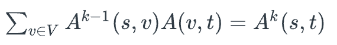
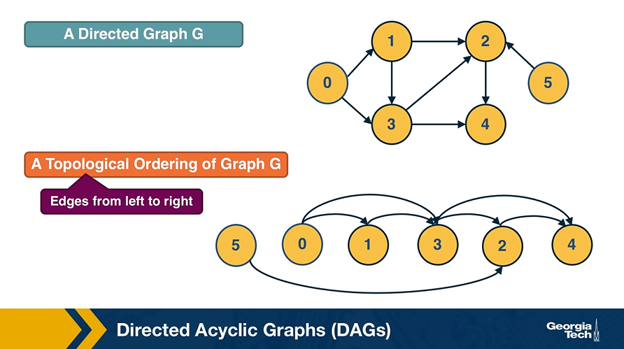
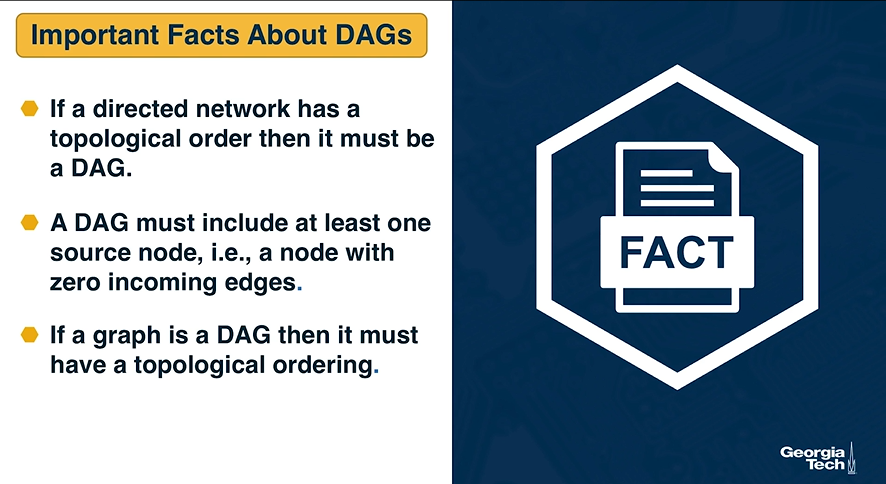
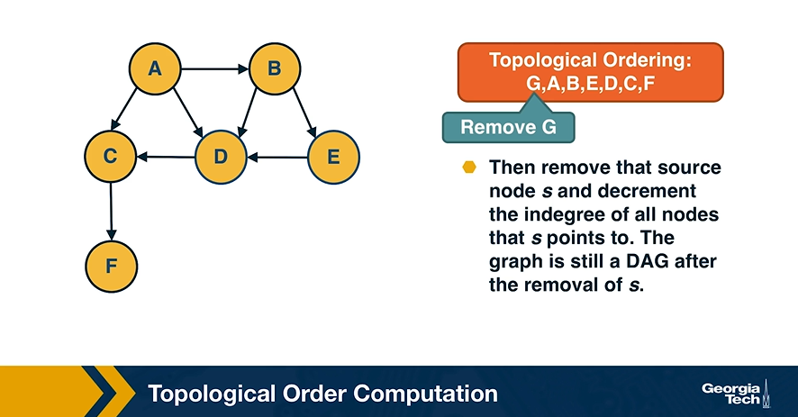
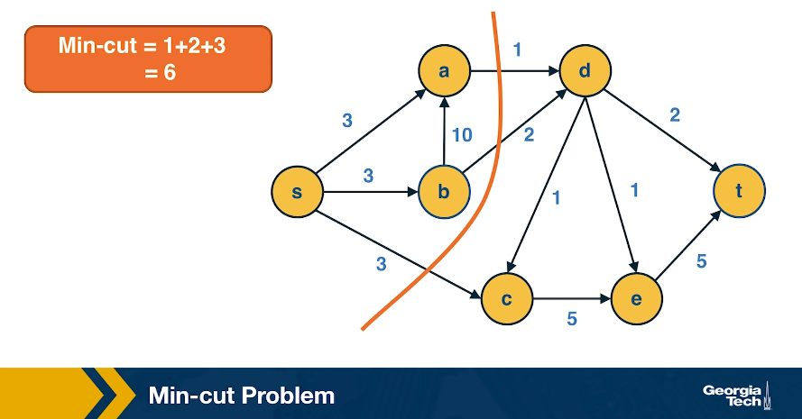
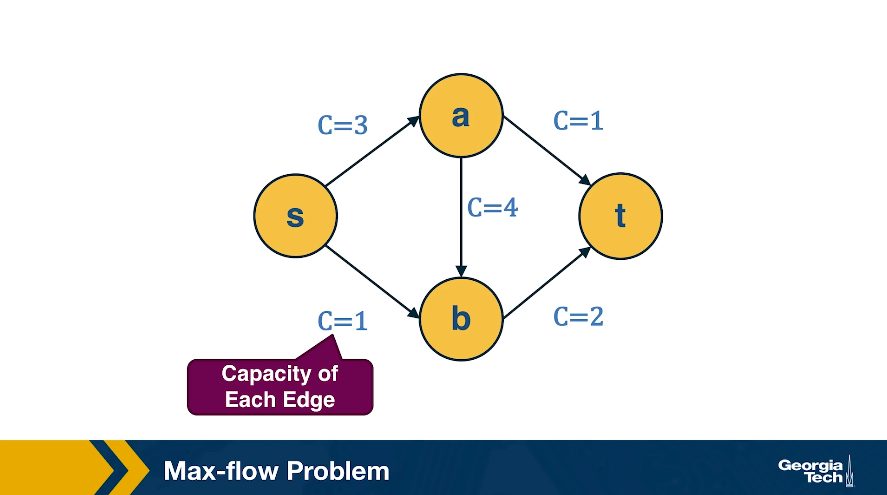
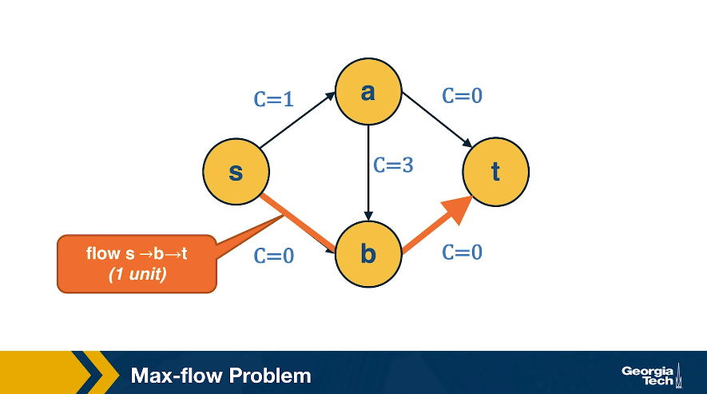
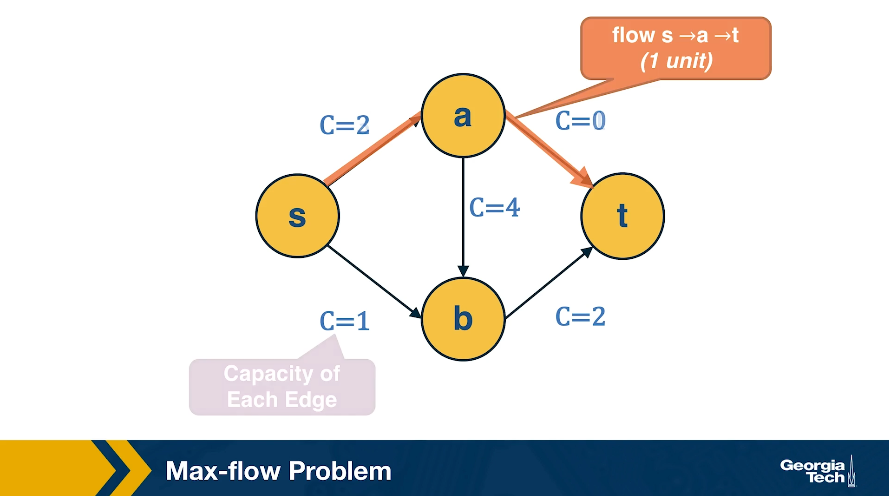

# Module 1 Lesson 02 - Relevant Concepts from Graph Theory

## An Introduction

This visualization shows the seven bridges of Königsberg. The birth of graph theory took place in 1736 when Leonhard Euler showed that it is not possible to walk through all seven bridges by crossing each of them once and only once. 

**Food for Thought**
- Try to model this problem with a graph in which each bridge is represented by an edge, and the landmass at each end of a bridge is represented by a node. The graph should have four nodes (upper, lower, the island in the middle, and the landmass at the right) and seven edges. What is the property of this graph that does not allow to walk through each edge once and only once? 
- You can start from any node you want, and end at any node you want. It is ok to visit the same node multiple times but you should cross each edge only once (this is referred to as a Eulerian path in graph theory).

## Undirected Graphs

Let’s start by defining more precisely what we mean by graph or network -- we use these two terms interchangeably. We will also define some common types of graphs.

A graph, or network, represents a collection of dyadic relations between a set of **nodes**. This set is often denoted by V because nodes are also called **vertices**.  The relations are referred to as **edges** or **links**, usually denoted by the set E. So, an edge (u,v) is a member of the set E, and it represents a relation between vertices u and v in the set V. 

The number of vertices is often denoted by n and the number of edges by m. We will often use the notation **G=(V,E)** to refer to a graph with a set of vertices V and a set of edges E. This definition refers to the simplest type of graph, namely undirected and unweighted. 

Typically we do not allow edges between a node and itself. We also do not allow multiple edges between the same pair of nodes. So the maximum number of edges in an undirected graph is  – or “n-choose-2”.  The **density** of a graph is defined as the ratio of the number of edges m by the maximum number of edges (n-choose-2). The number of connections of a node v is referred to as the **degree** of v. The example above illustrates these definitions. 

## Adjacency Matrix

A graph is often represented either with an Adjacency Matrix, as shown in this visualization. The matrix representation requires a single memory access to check if an edge exists but it requires n2 space. The adjacency matrix representation allows us to use tools from linear algebra to study graph properties.

For example, an undirected graph is represented by a symmetric matrix A – and so the eigenvalues of A are a set of real numbers (referred to as the “spectrum” of the graph). The equation at the right of the visualization reminds you the definition of eigenvalues and eigenvectors.

**Food for Thought**
- How would you show mathematically that the largest eigenvalue of the (symmetric) adjacency matrix A is less or equal than the maximum node degree in the network? Start from the definition of eigenvalues given above.

## Adjacency List

The adjacency list representation requires n+2\*m space because every edge is included twice. 

The difference between adjacency matrices and lists can be very large when the graph is sparse. A graph is sparse if the number of edges m is much closer to the number of nodes n than to the maximum number of edges (n-choose-2). In other words, the adjacency matrix of a sparse graph is mostly zeros. 

A graph is referred to as **dense**, on the other hand, if the number of edges is much closer to n-choose-2 than to n.  

It should be noted that most real-world networks are **sparse**. The reason may be that in most technological, biological and social networks, there is a cost associated with each edge – dense networks would be more costly to construct and maintain.

**Food for Thought**
- Suppose that a network grows by one node in each time unit. The new node always connects to k existing nodes, where k is a constant. As this network grows, will it gradually become sparse or dense (when n becomes much larger than k)?

## Walks, Paths and Cycles

**How can we efficiently count the number of walks of length k between nodes s and t?**
- Please think about this before you look at the answer below.

**Answer**

The number of walks of length k between nodes s and t is given by the element (s,t) of the matrix Ak (the k’th power of the adjacency matrix). 

Let us use induction to show this:

For k=1, the number of walks is either 1 or 0, depending on whether two nodes are directly connected or not, respectively. 

For k>1, the number of walks of length k between s and t is the number of walks of length k-1 between s and v, across all nodes v that connect directly with t. The number of walks of length k between s and v is given by the (s,v) element of the matrix Ak (based on the inductive hypothesis). So, the number of walks of length k between s to t is given by: 

## (Weakly) Connected Components

An undirected graph is connected if there is a path from any node to any other node. As we saw in Lesson-1, there are many real-world networks that are not connected – instead, they consist of more than one **connected components**. 

A **breadth-first-search** (BFS) traversal from a node s can produce the set of nodes in the connected component that includes s. Starting from any other node in that component would result in the same **connected component**. 

If we want to compute the set of all connected components of a graph, we can repeat this BFS process starting each time from a node s that does not belong to any previously discovered connected component. The running-time complexity of this algorithm is 𝝝(m+n) time because this is also the running-time of BFS if we represent the graph with an adjacency list.

Food-for-thought: If you are not familiar with the  notation, please read about them at: [https://en.wikipedia.org/wiki/Big_O_notation](https://en.wikipedia.org/wiki/Big_O_notation) 

## Trees and Other Regular Networks

In graph theory, the focus is often on some special classes of networks, such as trees, lattices, regular networks, planar graphs, etc. 

In this course, we will focus instead on complex graphs that do not fit in any of these special classes. However, we will sometimes contrast and compare the properties of complex networks with some regular graphs.

For instance, trees are connected graphs that do not have cycles – and you can easily show that the number of edges in a tree of n nodes is always m=n-1. 

A k-regular graph is a network in which every vertex has the same degree k. The visualization shows an example of a k-regular network for k=4.

A complete graph (or “clique”) is a special case of a regular network in which every vertex is connected to every other vertex (k=n-1). The example shows a clique with 6 nodes.

**Food for Thought**
- Suppose that a graph is k-regular. How would you show that a vector of n ones (1, 1, … 1) is an eigenvector of the adjacency matrix -- and the corresponding eigenvalue is equal to k?

## Directed Graphs

Another common class of networks is directed graphs. Here, each edge (u,v) has a starting node u and an ending node v. This means that the corresponding adjacency matrix may no longer be symmetric. 

A common convention is that the element (i,j) of the adjacency matrix is equal to 1 if the edge is from node i to node j – please be aware however that this convention is not universal.

We also need to revise our definition of node degree: the number of incoming connections to a node v is referred to as **in-degree** of v, and the number of outgoing connections as **out-degree** of v. 

**Food for Thought**
- Do you see that the sum of in-degrees across all nodes v is equal to the number of edges m? The same is true for the sum of out-degrees.

## Weighted Directed Graphs

So far we assumed that all edges have the same **strength** – and the elements of the adjacency matrix are either 0s or 1s. In practice, most graphs have edges of different strength – we can represent the strength of an edge with a number. Such graphs are referred to as weighted. 

In some cases the edge weights represent **capacity** (*especially when there is a flow of some sort through the network*). In other cases edge weights represent distance or cost (*especially when we are interested in optimizing communication efficiency across the network*). 

In undirected networks, the “strength” of a node is the sum of weights of all edges that are adjacent to that node. 

In directed networks, we define **in-strength** (*for incoming edges*) and **out-strength** (*for outgoing edges*).

In **signed graphs**, the edge weights can be negative, representing competitive interactions. For example, think of a network of people in which there are both friends and enemies (as shown in the visualization above). 

## Strongly Connected Components
In directed graphs, the notion of connectedness is different: a node s may be able to reach a node t through a (**directed**) path – but node t may not be able to reach node s. 

A directed graph is **strongly connected** if there is a path between all pairs of vertices. A **strongly connected component** (SCC) of a directed graph is a maximal **strongly connected** subgraph.

If the graph has only one SCC, we say that it is strongly connected. **How would you check (in linear time) if a directed graph is strongly connected**? Please think about this for a minute before you see the answer below.

**Answer**

First, note that a directed graph is strongly connected if and only if any node s can reach all other nodes, and every other node can reach s. So, we can pick any node s and then run BFS twice. First, on the original graph G. Second, run BFS on the graph G’ in which each edge has opposite direction than in G  -- G’ is called the _**reverse**_ graph of G. If both BFS traversals reach all nodes in G, it must be that G is strongly connected (do you see why?). 

The visualization above shows an example in which node D cannot reach S (*so S cannot reach D in the reverse graph*). 

**How would you compute the set of strongly connected components in a directed graph**? Two famous algorithms to do so are Tarjan’s algorithm and Kosaraju’s algorithm. They both rely on Depth-First Search traversals and run in 𝚯(n+m) time, if the graph is represented with an adjacency list. 

**Food for Thought**
We suggest you study Tarjan's or Kosaraju’s algorithm. For instance, Kosaraju's algorithm is described at: [Kosaraju's algorithm](https://en.wikipedia.org/wiki/Kosaraju%27s_algorithm)

## Directed Acyclic Graphs (DAGs)

#### How to show the previous three properties
- **First, if a directed network has a topological order then it must be a DAG.**
  - This is easy to show: if the network had a cycle, there would be an edge from a higher-rank node to a lower-rank node -- but this would violate the topological order property.

- **Second, a DAG must include at least one source node, i.e., a node with zero incoming edges.** 
  - To see that, start from any node of the DAG and start moving backwards, following edges in the opposite direction. Given that there are no cycles and the graph has a finite number of nodes, we will eventually reach a source node. 

- **Third, if a graph is a DAG then it must have a topological ordering.**
  - You can show this as follows:
    - Start from a source node s (we already showed that every DAG has at least one source node).
    - Then remove that source node s and decrement the in-degree of all nodes that s points to. The graph is still a DAG after the removal of s.
    - Choose a new source node s’ and repeat the previous step until all nodes are removed. 
- Note that the topological order of a DAG may not be unique.

## Dijkstra’s Shortest Path Algorithm
We are often interested in the shortest path (or paths) between a pair of nodes. Such paths represent the most efficient way to move in a network. 

In unweighted networks, all edges have the same cost, and the shortest path from a node s to any other node in the same connected component (or SCC for directed networks) can be easily computed in linear time using a Breadth-First Search traversal from node s.

If the network is weighted, and the weight of each edge is its **“length”** or **“cost”**, we can use Dijkstra’s algorithm, showed above, to compute the shortest path from s to any other node. **Note that this algorithm is applicable only if the weights are positive.** 

The key idea in the algorithm is that in each iteration we select the node m with the minimum known distance from s – that distance cannot get any shorter in subsequent iterations.  We then update the minimum known distance to every neighbor of m that we have not explored yet, if the latter is larger than the distance from s to m plus the cost of the edge from m to t. 

If the network is weighted and some weights are negative, then instead of Dijkstra’s algorithm we can use the Bellman-Ford algorithm, which is a classic example of dynamic programming. The running-time of Bellman-Ford is , where m is the number of edges and n is the number of nodes. On the other hand, the running time of Dijkstra’s algorithm is  if the latter is implemented with a Fibonacci heap (to identify the node with the minimum distance from s in each iteration of the loop).

**Food for Thought** 
- If you are not familiar with Fibonacci heaps, we suggest you review that data structure at: [Fibonacci heap](https://en.wikipedia.org/wiki/Fibonacci_heap)

## Random walk
In some cases, we do not have a complete map of the network. Instead, we only know the node that we currently reside at, and the connections of that node. When that is the case, it is often useful to perform a **random walk** in which we move randomly between network nodes. 

The simplest instance of a random walk process is to imagine a **walker** that moves iteratively from the node it currently resides on to one of v’s neighbors. The selection of which neighbor to visit next is random. In unweighted networks, if node v has k outgoing edges, the transition probability associated with each of those edges is 1/k. In weighted networks, the transition probabilities are functions of the edge weights. In either case, we can represent these transition probabilities with a matrix **P** in which the (i,j) element is the probability that the walker moves from node i to node j. 

If *q_t* is the vector that represents the probability that the walker is at each node at time t, then the random walk is described by the equation: *q_(t+1) = P^T * q_t*, where *P^T* is the transpose of the transition matrix. Note that the sum of the elements of *q_t* is equal to 1 for any time t.

An important question is: what is the probability that the walker will be found at a given node after many such transitions? If these probabilities converge asymptotically, we can think of them as the fraction of time that the walker spends at each node. This is referred to as the stationary distribution of the random walk. 

An important result is that, in undirected and connected networks, a stationary distribution always exists. The corresponding vector q is a solution of the equation *q = P^T * q* (but note that the solution may not be unique). See also the first "food-for-thought" question below. 

**Food for Thought**
  
1) Show that in undirected and connected networks in which the elements of the matrix **P** are strictly positive (and so there is at least a small probability of transitioning from every node to every other node),  the steady-state probability vector **q** is unique and it is the leading eigenvector of the transition matrix *P^T*.  

Hint: the largest eigenvalue of *P^T* is equal to 1. Why?

2) What can go wrong with the stationary distribution equation in directed networks?

## Min-Cut Problem

Another important concept in graph theory (and network science) is the notion of a **minimum cut** (or min-cut). Given a graph with a source node s and a sink node t, we define as **cut(s,t)** of the graph a set of edges that, if removed, will disrupt all paths from s to t. 

In unweighted networks, the min-cut problem refers to computing the cut with the minimum number of edges. In weighted networks, the min-cut refers to the cut with minimum sum of edge weights.

## Max-flow Problem

Another problem that occurs naturally in networks that have a source node s and a target node t is to compute a **"flow"** from s to t. 

The edge weights here represent the capacity of each edge, i.e., an edge of weight w>0 cannot carry more than w flow units. 

Additionally, edges cannot have a negative flow. 

The total flow that arrives at a non-terminal node v has to be equal to the total flow that departs from v – in other words, flow is conserved.

The max-flow problem refers to computing the maximum amount of flow that can originate at s and terminate at t, subject to the capacity constraints and the flow conservation constraints. 

The max-flow problem can be solved efficiently using the **Ford-Fulkerson** algorithm, as long as the capacities are rational numbers. In that case, the running time of the algorithm is *O(mF)*, where m is the number of edges and F is the maximum capacity of any edge.

The algorithm works by constructing a **residual network**, which shows at any point during the execution of the algorithm the residual capacity of each edge. In each iteration, the algorithm finds a path from s to t with some residual capacity (we can use BFS or DFS on the residual network to do that). Suppose that the minimum residual capacity among the edges of the chosen path is f. We add f on the flow of every edge (u,v) along that path, and decrease the capacity of those edges by f in the residual network. We also add f on the capacity of every reverse edge (v,u) of the residual network. The capacity of those reverse edges is necessary so that we can later reduce the flow along the edge (u,v), if needed, by routing some flow on the edge (v,u). 

**Food-for-thought:**
- Construct the residual network (also showing the flow on the reverse edges) for the example shown in the previous video. 

## Max-flow=Min-cut
An important result about the min-cut and max-flow problems is that they have the same solution: the sum of the weights of the min-cut is equal to the max-flow in that network.

**Part A:**  ANY cut(L,R) such that s∈L  and t∈R  has capacity ≥  ANY flow from s to t.
Thus: mincut(s,t)≥maxflow(s,t)

**Part B:** IF *f\** = maxflow(s,t) , the network can be partitioned in two sets of nodes L and R with s∈L  and t∈R , such that:

All edges from L to R have flow =capacity
All edges from R to L have flow = 0.
So, edges from L to R define a  cut(s,t) with capacity = maxflow(s,t) and, because of Part A, this cut is mincut(s,t).

Thus: mincut(s,t)=maxflow(s,t)

## Bipartite Graphs
Another important class of networks is bipartite graphs. Their defining property is that the set of nodes V can be partitioned into two subsets, L and R, so that every edge connects a node from L and a node from R. There are no edges between L nodes – or between R nodes. 

**Food for Thought**
Show the following theorem. A graph is bipartite if and only if it does not include any odd-length cycles. 

## A Recommendation System as a Bipartite Graph
Let's close this lesson with a practical application of bipartite graphs. 

Suppose you want to create a **“recommendation system”** for an e-commerce site. You are given a dataset that includes the items that each user has purchased in the past. You can represent this dataset with a bipartite graph that has users on one side and items on the other side. Each edge (user, item) represents that that user has purchased the corresponding item. 

**How would you find users that have similar item preferences?** Having such **“similar users”** means that we can give recommendations that are more likely to lead to a new purchase.

This question can be answered by computing the **“one-mode projection”** of the bipartite graph onto the set of users. This projection is a graph that includes only the set of users – and an edge between two users if they have purchased at least one common item. The weight of the edge is the number of items they have both purchased. 

**How would you find items that are often purchased together by the same user?** Knowing about such **“similar items”** is also useful because we can place them close to each other or suggest that the user considers them both.

This can be computed by the **“one-mode projection”** of the bipartite graph onto the set of items. As in the previous projection, two items are connected with a weighted edge that represents the number of users that have purchased both items.

## Co-citation and Bibliographic Coupling

The previous one-mode projections can also be computed using the adjacency matrix A that represents the bipartite graph. 

Suppose that the element (i,k) of A is 1 if there is an edge from i to k – and 0 otherwise. 

The co-citation metric *C_i,j* for two nodes i and j is the number of nodes that have outgoing edges to both i and j. If i and j are items, then the co-citation metric is the number of users that have purchased both i and j. 

On the other hand, the bibliographic coupling metric *B_i,j* for two nodes i and j is the number of nodes that receive incoming edges from both i and j. If i and j are users, then the bibliographic coupling metric is the number of items that have been purchased by both i and j.

As you can see both metrics can be computed as the product of A and A^T – the only difference is the order of the matrices in the product.

## Lesson Summary

The objective of this lesson was to review a number of important concepts and results from graph theory and graph algorithms. 

We will use this material in subsequent lessons. For example, the notion of random walks will be important in the definition of the PageRank centrality metric, while the spectral properties of an adjacency matrix will be important in the eigenvector centrality metric. 

The Module-1 assignment will also help you understand these concepts more deeply, and to learn how to apply them in practice with real-world network datasets.

