# Module 3 Lesson 07 - Modularity and Community Detection

## Learning Objectives
Students will be able to:
- Understand the community detection problem
- Utilize the modularity metric and appreciate its limitations
- Analyze and deploy algorithms for community detection 
- Understand the notion of hierarchical modularity

## Required and Recommended Reading
**Required Reading**
- Chapter-9 from A-L. Barabási, [Network Science](http://networksciencebook.com/), 2015.

## The Graph Partitioning Problem

Let us start with “graph partitioning” – a classical problem in computer science. 

Given a graph, how would we partition the nodes into two non-overlapping sets of the same size so that we minimize the number of edges between the two sets? This is also known as the “minimum bisection problem”.

The visualization at the right shows such a bisection. Note that there are only four edges that cross the partition boundary (red dashed line) – and each set in the partition has seven nodes. 

We can also state more general versions of this problem in which we partition the network into K non-overlapping sets of the same size, where K>2 is a given constant. 

The graph partitioning problem is important in many applications. For instance, in distributed computing, we are given a program in which there are N interacting threads but we only have K processors (K\<N). The interactions between threads can be represented with a graph, where each edge represents a pair of threads that need to communicate while processing.  It is important to assign interacting groups of threads to the same processor (so that we minimize the inter-processor communication delays) and to also equally split the threads between the K processors so that their load is balanced.

The graph partitioning problem is NP-Complete and so we only have efficient algorithms that can approximate its solution. The Kerninghan-Lin algorithm – as shown in the visualization above -- iteratively switches one pair of nodes between the two sets of the partition, selecting the pair that will cause the largest reduction in the number of edges that cut across the partition. 

For our purposes, it is important to note that in the graph partitioning problem we are given the number of sets in the partition and that each set should have the same size. As we will see, this is very different than the community detection problem.

## Network Community Detection
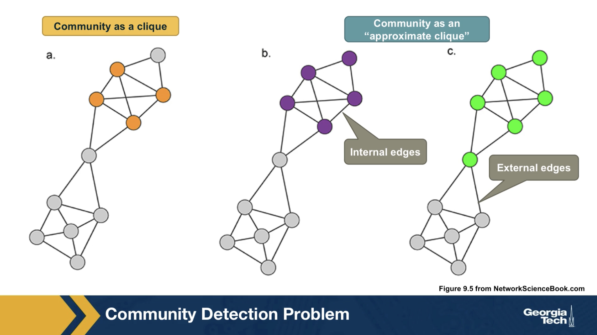

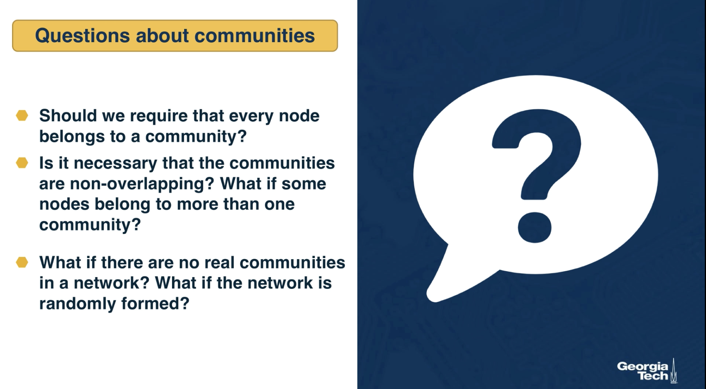

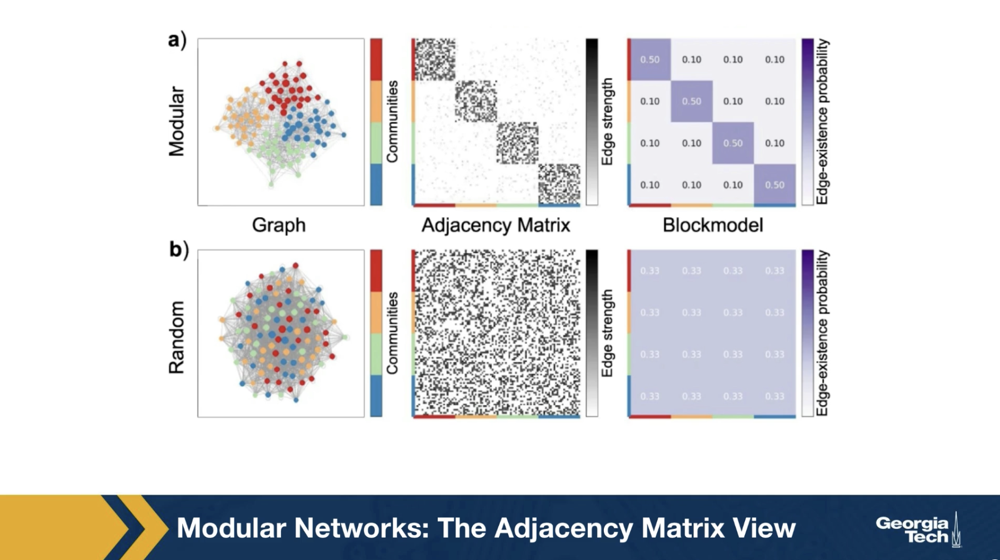

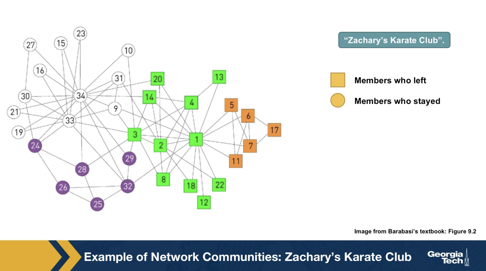

## Community Detection Based on Edge Centrality Metrics

A family of algorithms for community detection is based on hierarchical clustering. The goal of such approaches is to create a tree structure, or “dendrogram”, that shows how the nodes of the network can iteratively split in a top-down manner into smaller and smaller communities (**“divisive hierarchical clustering”**) – or how the nodes of the network can be iteratively merged in a bottom-up manner into larger and larger communities (**“agglomerative hierarchical clustering”**).   

Let us start with divisive algorithms. We first need a metric to select edges that fall between communities – the iterative removal of such edges will gradually result in smaller and smaller communities.   

One such metric is the edge (shortest path) betweenness centrality, introduced in Lesson-6. Recall that this metric is the fraction of shortest paths, across all pairs of terminal nodes, that traverses a given edge.  Visualization (a) shows the value of the betweenness centrality for each edge. Removing the edge with the maximum centrality value (0.57) will partition the network into two communities. We can then recompute the betweenness centrality for each remaining edge, and repeat the process to identify the next smaller communities.  This algorithm is referred to as **"Girvan-Newman"** in the literature. 

Another edge centrality metric that can be used for the same purpose is the random walk betweenness centrality. Here, instead of following shortest paths from a node u to a node v, we compute the probability that a random walk that starts from u and terminates at v traverses each edge e, as shown in visualization (b).  The edge with the highest such centrality is removed first.   

Note that the computational complexity of such algorithms depends on the algorithm we use for the computation of the centrality metric. For betweenness centrality, that computation can be performed in O(LN), where L is the number of edges and N is the number of nodes. Given that we remove one edge each time, and need to recompute the centrality of the remaining edges in each iteration, the computational complexity of the Girvan-Newman algorithm is O(L2 N). In sparse networks the number of edges is in the same order with the number of nodes, and so the Girvan-Newman algorithm runs in O(N3).   

## Divisive Hierarchical Community Detection 

*Image 9.12 from networksciencebook.com "The final steps of a divisive algorithm mirror those we used in agglomerative clustering: 1. Compute the centrality xij of each link. 2. Remove the link with the largest centrality. In case of a tie, choose one link randomly. 3. Recalculate the centrality of each link for the altered network. 4. Repeat steps 2 and 3 until all links are removed.*

To illustrate the iterative top-down process followed by divisive hierarchical community detection algorithms, let us focus on the edge betweenness centrality metric.   

The Girvan-Newman algorithm uses that metric to remove a single edge in each iteration – the edge with the highest edge betweenness centrality.   

The value of the edge betweenness centrality of the remaining edges has to be re-computed because the set of shortest paths changes in each iteration.  

The visualizations **(a)** through **(d)** show how a toy network changes in four steps of the algorithm, after removing three successive edges. The removal of the first edge, between C and D, creates the first split in the dendrogram, starting at the root. At the left, we have a community formed by A, B, and C – while at the right we have a community with all other nodes.  

The next split takes place after we remove two edges, the edge between G and H and the edge between D and I. At that branching point the dendrogram shows three communities: (A,B,C), (D,E,F,G) and (H,I,J,K) (as shown by the horizontal yellow line).   

The process can continue, removing one edge at a time, and moving down the dendrogram, until we end up with isolated nodes.   

Note that a hierarchical clustering process does NOT tell us what is the best set of communities – each horizontal cut of the dendrogram corresponds to a different set of communities. So we clearly need an additional objective or criterion to select the best such set of communities. Such a metric, called modularity M, is shown in the visualization (f), which suggests we cut the dendrogram at the point of three communities (yellow line).  We will discuss the metric M a bit later in this lesson.    

This algorithm always detect communities in a given network. So, even a random network can be split in this hierarchical manner, even though the resulting communities may not have any statistical significance.    

**Food For Thought**
- How would you check if the detected communities have statistical significance, so that a random network does not have any community structure?

## Agglomerative Hierarchical Clustering Approaches - Node Similarity Metric

Let us now switch to agglomerative (or bottom-up) hierarchical clustering algorithms.   

Here, we start the dendrogram at the leaves, one for each node. In each iteration, we decide which nodes to merge so that we extend the dendrogram by one branching point towards the top. The merged nodes should ideally belong to the same community. So we first need a metric that quantifies how likely it is that two nodes belong to the same community.   

If two nodes, i and j, belong to the same community, we expect that they will both be connected to several other nodes of the same community. So, we expect that i and j have a large number of common neighbors, relative to their degree.   

To formalize this intuition, we can define a similarity metric S_i,j between any pair of nodes i and j:  

S_i,j = (N_i,j + A_i,j) / min{k_i, k_j}

where N_i,j is the number of common neighbors of i and j, A_i,j is the adjacency matrix element for the two nodes (1 if they are connected, 0 otherwise), and k_i is the degree of node i.     

Note that S_i,j = 1 if the two nodes are connected with each other and every neighbor of the lower-degree node is also a neighbor of the other node.     

On the other hand, S_i,j = 0 if the two nodes are not connected to each other and they do not have any common neighbor.     

The visualization at the left shows the node similarity value for each pair of connected nodes.   

The visualization at the rights shows the color-coded node similarity matrix, for every pair of nodes (even if they are not connected). Note that three groups of nodes emerge with higher similarity values: (A, B, C), (H,I,J,K) and (E,F,G). Node D on the other hand has a lower similarity with any other node, and it appears to be a **“connector”** between the three communities.  

**Food For Thought**
- What if a node has no connections? How should we modify this similarity metric to deal with that case?
 
## Hierarchical Clustering Approaches – Group Similarity

*Image 9.10 from networksciencebook.com Three approaches, called single, complete and average cluster similarity, are frequently used to calculate the community similarity from the node-similarity matrix xij*

How to compute the similarity between two groups of nodes (as opposed to individual nodes)?  

In other words, if we are given two groups of nodes, say 1 and 2, and we know the pairwise node similarities, how to compute the similarity between groups 1 and 2? 

**There are three ways to do so:** 
1. Single linkage: the similarity of groups 1 and 2 is determined by the minimum distance (i.e., maximum similarity) across all pairs of nodes in groups 1 and 2.  
2. Complete linkage: the similarity of groups 1 and 2 is determined by the maximum distance (i.e., minimum similarity) across all pairs of nodes in groups 1 and 2. 
3. Average linkage: the similarity of groups 1 and 2 is determined by the average distance (i.e., average similarity) across all pairs of nodes in groups 1 and 2. 

The visualization illustrates the three approaches. Note that this figure gives the pairwise distance between nodes. The similarity between two nodes can be thought of as inversely related to their distance.  

Average linkage is the most commonly used metric. 

**Where to “cut” the dendrogram and computational complexity**

*A hierarchical tree in which any cut of the hierarchical tree offers a potentially valid partition (Image 9.15) from networksciencebook.com*

Now that we have defined a similarity metric for two nodes (based on the number of common neighbors), and we have also learned how to calculate a similarity value for two groups of nodes, we can design the following iterative algorithm to compute a hierarchical clustering dendrogram in a bottom-up manner.  

We start with each node represented as a leaf of the dendrogram. We also compute the matrix of N^2 pairwise node similarities.  

In each step, we select the two nodes, or two groups of nodes more generally, that has the highest similarity value – and merge them into a new group of nodes. This new group forms a larger community and the corresponding merging operation corresponds to a new branching point in the dendrogram.  

The process completes until all the nodes belong in the same group (root of the dendrogram).  

Note that depending on where we **“cut”** the dendrogram we will end up with a different set of communities. For instance, the lowest horizontal yellow line at the visualization corresponds to four communities (green, purple, orange, and brown) – note that node D forms a community by itself.  

The computational complexity of this algorithm, which is known as **Ravasz algorithm**, is O(N^2) because the algorithm requires: 

1. O(N^2)for the initial calculation of the pairwise node similarities 
2. O(N) for updating the similarity between the newly formed group of nodes and all other groups – and this is performed in each iteration, resulting in O(N^2)
3. O(N log N)for constructing the dendrogram 

**Food For Thought**
- Try to think of another agglomerative hierarchical clustering approach, based on a different similarity metric.

## Modularity Metric

All approaches for community detection we have seen so far cannot answer the following two questions:  

Which level of the dendrogram, or more generally, which partition of the nodes into a set of communities is the best?  

And, are these communities statistically significant?  

The modularity metric gives us a way to answer these questions. The idea is that randomly wired networks should not have communities -- and so a given community structure is statistically significant if the number of internal edges within the given communities is much larger than the number of internal edges if the network was randomly rewired (but preserving the degree of each node).   

In more detail: suppose we are given a network with N nodes and L edges – for now, let us assume that the network is undirected and unweighted.   

We denote the degree of node i as k_i.   

Additionally, we are given partitioning of all nodes to a set of C hypothetical communities C_1, C_2, ...C_c.   

Our goal is to evaluate this community structure – how good it is and whether it is statistically significant.   

Let A be the network adjacency matrix.   

The number of internal edges between all nodes of community C_c is

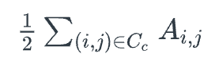

On the other hand, if the connections between nodes are randomly made, the expected number of internal edges between all nodes of that community is,  

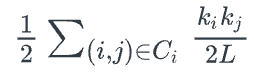

because node i has k_i stubs and the probability that any of those stubs connect to a stub of node j is k_j/2L.

So, we can define the modularity metric based on the difference between the actual number of internal edges and the expected number of internal edges, across all C communities:  

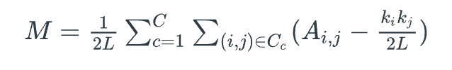

We divided by the total number of edges L, so that M is always less than 1.   

Note that the modularity metric does not directly penalize any external edges, i.e., there is no term in this equation that decreases the modularity for every external edge between two communities. The more external edges exist however, the lower is the sum of the internal edges, while the sum of the expected number of random edges remains constant. In other words, the modularity metric indirectly selects community assignments that have more internal edges and fewer external edges.   

How can we use this metric to select between different community structures? It is simple: select the set of communities that has the larger modularity value.  

And how can we know if a given community structure is statistically significant? A simple way to answer this question is by comparing the modularity of a network with 0, which is the value we would expect from a randomly wired network.   

Alternatively, we can generate an ensemble of random networks using degree-preserving randomization and estimate the distribution of modularity values in that ensemble. We can then use a one-sided hypothesis test to evaluate whether the modularity of the original network is larger than that distribution, for a given statistical significance level.    

## Modularity Metric- Derivation

We can now derive a more useful formula for the modularity metric, starting from the definition we gave earlier:  

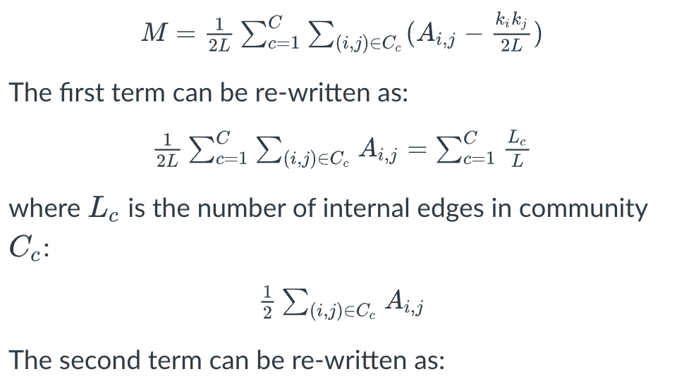
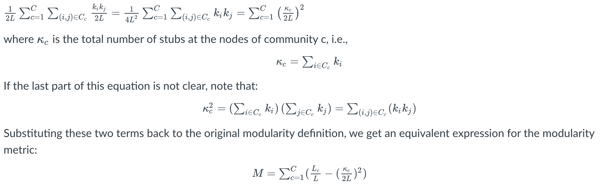

This expression is quite useful because it expresses the modularity of a given community assignment as a summation, across all communities, of the following difference:   

the fraction of network edges that are internal to community C_c MINUS the squared fraction of total edge stubs that belong to that community.   

**Food For Thought**
- Use this modularity formula to calculate the modularity of each of the following partitions: a) all nodes are in the same community, b) each node is in a community by itself, c) each community includes nodes that are not connected with each other, d) a partition in which there are no inter-community edges. 

## Modularity Metric – Selecting The Community Assignment

*Four partitions of a network: a) optimal partition b) suboptimal partition c) single community d) negative modularity (Image 9.16) from networksciencebook.com*

To get a better intuition about the modularity metric, consider the 9-node network shown in the visualization. Visually, we would expect this network to have two communities: the group of five nodes at the left and the group of four nodes at the right.   

The visualization shows four possible community assignments.   

The first two assignments have two communities. Assignment (a) is what we would expect visually and it has a modularity of M=0.41. It turns out that this is the highest possible modularity value for this network.   

Assignment (b) is clearly a suboptimal community structure -- and indeed it has a lower modularity value (M=0.22)  

Assignment (c) assigns all nodes to the same community – resulting in a modularity value of 0. Clearly this is not a statistically significant community.   

Finally, assignment (d) assigns each node to its own community, resulting in a negative modularity value.   

Now that we have a way to compare different community assignments, we can return to the hierarchical clustering approaches we saw earlier (both divisive and agglomerative) and add an extra step, after the construction of the dendrogram:   

Each branching point of the dendrogram corresponds to a different community assignment, i.e., a different partition of the nodes in a set of communities. So, we can calculate the modularity at each branching point, and select the branching point that leads to the highest modularity value.   

**Modularity Metric – For Directed and/or Weighted Networks**

The modularity definition can be easily modified for directed and/or weighted networks.   

Consider directed and unweighted networks first. Suppose that the out-degree of node i is k_i,out, and the in-degree of node j is k_j,in.

Further, suppose that A_i,j = 1 if there is an edge from node i to node j – and 0 otherwise.   

We can rewrite the modularity definition as:  

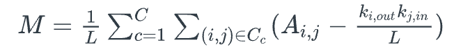

Similarly, if the network is both weighted and directed, suppose that the “out-strength” (i.e., the sum of all outgoing edge weights) of node i is s_i,out, while the in-strength of node j is s_j,in.   

Further, suppose that A_i,j is the weight of the edge from node i to node j – and 0 if there is no such edge.   

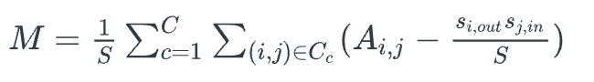

where S is the sum of all edge weights. 

**Food For Thought**
- Explain why the modularity formula for directed networks has the term L instead of 2L. 

## Modularity After Merging Two Communities 

In the following pages, we will discuss a couple of algorithms that perform community detection by gradually merging smaller communities into larger communities.   

Before we look at these algorithms, however, let us derive a simple formula that shows how the modularity of a network increases when we merge two communities into a new community.   

In more detail, suppose that community A has a number of internal links L_A and a total degree κ_A. Similarly for community B.   

What happens if we create a new community assignment in which A and B are merged into a single community, call it {AB}, while all other communities remain the same?  

The number of internal links in {AB} is L_AB = L_A + L_B + l_AB, where l_AB is the number of external links between communities A and B.   

The total degree of community {AB} is κ_AB = κ_A + κ_B.   

Using the modularity formula we derived earlier, we can now calculate the modularity difference after merging A and B:  
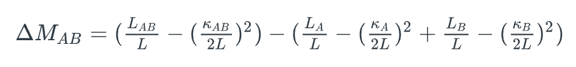

All the remaining terms, related to communities other than A and B, have not been changed after the merging and so they cancel out.   

After some basic algebra in this expression, we can simplify the modularity difference after merging A and B to:  

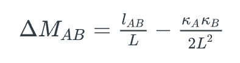

This is a useful expression, showing that the merging step results in higher modularity only when the number of links between A and B is sufficiently large for the first term to be larger than the second term. And the larger the communities A and B are, the larger the second term is. Otherwise, this merging operation causes a reduction in the modularity of the new community assignment.  

**Food For Thought**
- If the previous derivations are not clear, please do the algebra in more detail yourself.

## Greedy Modularity Maximization

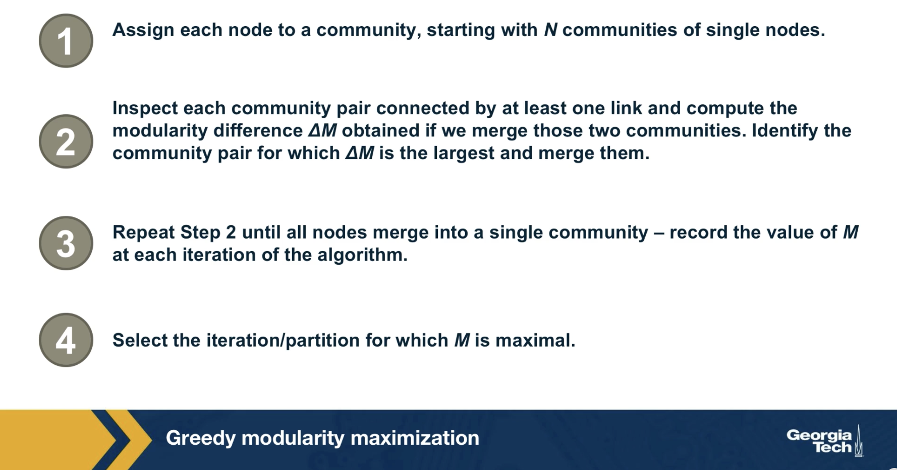

**Computational Complexity**
Since the calculation of each ΔM can be done in constant time, Step-2 of the greedy algorithm requires O(L) computations. After deciding which communities to merge, the update of the matrix can be done in a worst-case time O(N). Since the algorithm requires N–1 community mergers, its complexity is O[(L + N)N], or O(N2) on a sparse graph. 

**Optimized Greedy Algorithm**
The use of data structures for sparse matrices can decrease the greedy algorithm’s computational complexity to O(N log2N). For more details please read the paper Finding community structure in very large networksLinks to an external site. by Clauset, Newman and Moore. 

## Louvain Algorithm
The Louvain algorithm is a more computationally efficient modularity maximization algorithm than the previous greedy algorithm.   

Even if the original network is unweighted, the Louvain algorithm creates a weighted network (as described later), and for this reason, all modularity calculations are performed using the modularity formula for weighted networks we saw earlier. 

*The main steps of the Louvain algorithm. Each pass consists of two distinct steps. The sum of Steps I & II are called a pass. The network obtained after each pass is processed again, until no further increase of modularity is possible. (Modified from Image 9.37 from networksciencebook.com)*

**The Louvain consists of two steps:** 

- **Step-I**
	- Start with a network of N nodes, initially assigning each node to a different community. For each node i, we evaluate the modularity change if we place node i in the community of any of its neighbors j.   
	- We move node i in the neighboring community for which the modularity difference is the largest -- but only if this difference is positive. If we cannot increase the modularity by moving i, then that node stays in its original community.   
	- This process is applied to every node until no further improvement can be achieved, completing Step-I.  
	- The modularity change ΔM that results by merging a single node i with the community A of a neighboring node is similar to the formula we derived earlier – but for weighted networks:  

		- 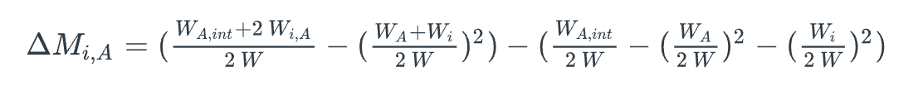
		- where W_A is the sum of weights of all links in A, W_A,int is the sum of weights of all internal links in A, W_i is the sum of weights of all links of node i
		- W_i,A is the sum of weights of all links between node i and any node in A, and W is the sum of weights of all links in the network.    
- **Step-II**
	- We now construct a new network (a weighted network) whose nodes are the communities identified during Step-I. The weight of the link between two nodes in this network is the sum of weights of all links between the nodes in the corresponding two communities. Links between nodes of the same community lead to weighted self-loops.  
	- Once Step-II is completed, we have completed the first pass of the algorithm.   
	- Steps I – II can be repeated in successive passes. The number of communities decreases with each pass. The passes are repeated until there are no more changes and maximum modularity is attained. 	 
		- The visualization shows the expected modularity change ΔM_0,i for node 0. Accordingly, node 0 will join node 3, as the modularity change for this move is the largest, being ΔM_0,3=0.032.   
	- This process is repeated for each node, the node colors corresponding to the resulting communities, concluding Step-I.   
	- In Step-II, the communities obtained in Step-I are aggregated, building a new network of communities. Nodes belonging to the same community are merged into a single node, as shown on the top right.   
	- This process generates self-loops, corresponding to links between nodes in the same community that is now merged into a single node. 

**Food For Thought**
- The description of the Louvain algorithm here is only at a high-level. We recommend you also read the original publication that proposed this algorithm. Also, show that the computational complexity of this algorithm is 

## Modularity Resolution

You may be wondering: is the modularity metric always a reliable way to choose a community assignment? Does it ever fail to point us in the right direction? 

The answer is yes. The modularity metric cannot be used to discover very small communities, relative to the size of the given network.  

To see why recall the formula we derived earlier for the change in modularity after merging two communities A and B: 

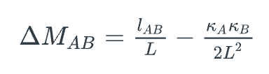

*A partition in which pairs of neighboring cliques are merged into a single community, as indicated by the dotted lines. (Image 9.34) from networksciencebook.com*

Suppose that a network consists of multiple communities, as shown in the visualization, with only a single link between any two communities. Clearly, a good community detection algorithm should not merge any of these communities  

To simplify, suppose that the total degree of each community is κ_l. Based on the previous formula, if we merge any two of these connected communities the modularity difference will be: 

In other words, a modularity maximization algorithm will always merge two communities if the total degree of each of those communities is smaller than the critical value sqrt(2L).

This critical value is referred to as modularity resolution because it is the smaller community size (in terms of total degree) that a modularity maximization algorithm can detect.  

 For example, for a network with a million links, the modularity resolution is 1414, which means that any two connected communities (even with a single link) with total degree less than this limit will be merged, and so they will not be correctly identified.  

**Food For Thought**
How would you try to avoid the modularity resolution issue -- and try to discover even small communities? 

## The Modularity Search Landscape 

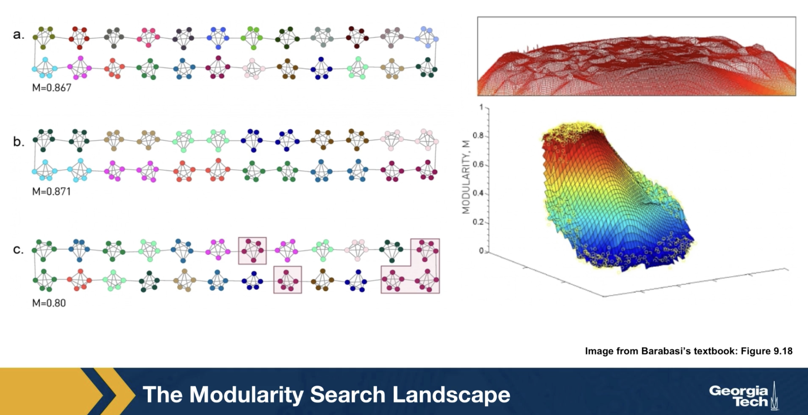

## Communities Within Communities

*A hierarchical model  that generates a scale-free network with degree exponent. (Image 9.13 from networksciencebook.com)*

In many real-world networks, we observe communities within communities within communities, etc. For example, in a professional organization, we may observe small communities of 3-4 people that work together on a specific component of a large project, nested within a larger community of 20-30 members working on that the project, nested within an entire department of 100+ people, etc.  

This is referred to as **Hierarchical Modularity**. Each module corresponds to a community of nodes. Smaller, more tightly connected communities can be members of larger but less tightly connected larger communities. This recursive process can continue for multiple levels until we reach a level in which the group of nodes is so loosely connected that they do not form a community anymore.  

A prototypical example of such a hierarchically modular architecture is illustrated in this visualization. The most elementary community is a five-node clique module (part a).   Note that the diagonal elements are also connected even though it is not very clear in the illustration. 

At the next level (part b), we see a similar structure that is composed of five of those cliques,  with the clique at the middle playing the role of the “connector” for the four peripheral cliques. Note that the network at this level is NOT a clique, and so it is less tightly connected than the five smaller communities it is composed of.   

At the third level of the hierarchy (part c), we connect in a similar manner five instances of the part-b module. Again, the module at the center is the connector of the four peripheral modules, and again the density of the connections at that level is lower than the density at the previous level.   

This is of course an extreme example of hierarchical modularity – the connections are deterministic and the connectivity pattern is the same at every layer. In practice, most networks have some degree of randomness and the depth of these hierarchies may not exceed a certain maximum level for practical reasons (for example: what is the maximum hierarchical depth in your professional organization or university?)  

Nevertheless, the deterministic structure of this toy network allows us to derive mathematically an interesting property of this network: namely, the clustering coefficient of a node in this network drops proportionally to the inverse of the node’s degree:  

C(k) \~= 2/k

We will not show the derivation here – it is simple however and you can find it in  your textbook.

This is an interesting “signature” for this hierarchically modular network – the more connected a node is, the less interconnected its neighbors are. This is very different than random networks, without any community structure, in which the clustering coefficient is independent of the degree. 

**Food For Thought**
- Please go through the derivations for the above clustering coefficient in your textbook.

## Clustering Coefficient Versus Degree in Practice

*Hierarchy in Real Networks. (Image 9.36) from networksciencebook.com*

Do we see this inversely proportional relationship between the clustering coefficient and degree in real-world networks? And if so, is it a reliable indicator of hierarchical modularity?   

 The visualization shows plots of the node clustering coefficient C(k) versus node degree k for six real-world networks (purple dots). You can find additional information about these six datasets in your textbook.   

The green dots refer to a corresponding degree-preserving randomized network – this is an important step of the analysis because by randomizing the network connections (without changing the degree distribution), we remove the community structure of the original network from the randomized network.   

The black dotted line corresponds to the relation C(k) = 1/k. As we saw in the previous page, this is the slope of C(k) versus k in the deterministic hierarchically modular network that we saw earlier.   

Note that some networks, such as the network of scientific collaborations or the citation network show clearly an inverse relation between C(k) and k, especially for nodes with degree k>10. Further, when we randomize the connections of those networks, removing the community structure, C(k) becomes independent of k. So, we expect that such networks exhibit a hierarchically modular structure.   

The situation is not always so clear, however. Some other networks, such as the metabolic network or the email network, show an inverse relation between C(k) and k – but the same is true for the corresponding randomized networks! This raises the concern that the inverse relation between C(k) and k may be caused in some cases at least by the degree distribution – and not by the community structure of the network.   

Finally, there are also networks in which we do not see a decreasing relation between C(k) and k, such as the mobile phone calls network or the power grid.  

To summarize, hierarchical modularity is an important property of many (but not all) real-world networks, and when present, it exhibits itself with an inversely proportional between the clustering coefficient and the node degree. However, this relation is not sufficient evidence for the presence of hierarchical modularity. 

## Hierarchical Modularity Through Recursive Community Detection

*The Greedy Algorithm. (Image 9.17) from networksciencebook.com*

Another approach to investigate the presence of hierarchical modularity is by applying a community detection algorithm in a recursive manner. The first set of discovered communities correspond to the top-level, larger communities. Then we can apply the same algorithm separately to each of those communities, asking whether there is a finer resolution community structure within each of those top-level communities. The process can continue until we reach a level at which a given community does not have a clear sub-community structure.  

To illustrate this process, the visualization above refers to a collaboration network between about 55,000 physicists from all branches of physics who posted papers on arxiv.org. At the top-level (part a), the greedy modularity maximization algorithm detects about 600 communities and the modularity is M=0.713.  The largest of those communities include about 13,500 scientists and 93% of them publish in condensed matter (C.M) physics. The second-largest community consists of about 11,000 scientists and 87% of those scientists publish in High Energy Physics (HEP).  

If we apply the same community detection algorithm to the third-largest community, we identify a number of smaller communities, and the modularity of that community assignment is 0.807 (part b).   

If we continue at a third level, applying the same algorithm to a community of 134 nodes we reach a point at which we identify research groups associated with scientists at different universities (part c).

## Lesson Summary 

This lesson introduced you to the concept of community in the context of networks.  

We contrasted the problem of community detection to the ”cleaner” problem of graph partitioning,  emphasizing that in the former we do not know the number of communities – or even if the network has any communities in the first place.   

A key concept in the community detection problem has been the modularity of a network. This metric allows us to compare different community assignments on the same network – and to examine whether a network has a strong community structure in the first place.

We also saw however that the modularity metric has a finite resolution and that we cannot detect communities of a smaller size than that resolution.   

We also saw a number of algorithms for community detection, including divisive and agglomerative hierarchical clustering algorithms, greedy modularity maximization, and the Louvain algorithm. The literature in this area includes 100s of algorithms but the most commonly used are those we covered here.   

We also discussed the concept of hierarchical modularity – and how it relates to the relation between the clustering coefficient and node degree. 

In the subsequent lesson, we will cover more advanced topics of community detection – including overlapping communities and dynamic communities. We will also cover how to compare and characterize different community structures.  

