# Module 4 Lesson 09 - Spreading Phenomena on Networks and Epidemics

## Learning Objectives
Students will be able to:

- Define what **“network contagion”** means 
- Analyze standard network epidemic models in the context of realistic network models 
- Explain how the structure of a network can have a major effect on the function and dynamic activity on that network 
- Understand the role of superspreaders in epidemics

## Required and Recommended Reading
**Required Reading**
- Chapter 10 -A-L. Barabási, [Network Science](http://networksciencebook.com/), 2015 

**Recommended Reading**
- [Super-spreaders in infectious diseasesLinks to an external site. Richard A.Stein](https://www.ijidonline.com/article/S1201-9712(11)00024-5/fulltext), International Journal of Infectious Diseases, August 2011
- [Cellular Superspreaders: An Epidemiological Perspective on HIV Infection inside the Body](https://journals.plos.org/plospathogens/article?id=10.1371/journal.ppat.1004092). Kristina Talbert-Slagle et al., 2014

## Spreading Phenomena on Networks & Epidemics

The COVID-19 pandemic has changed our world in ways that we can still not comprehend. Millions of people have been infected and hundreds of thousands have died. Epidemics and pandemics are not new, however. They have been a major threat to humanity since the beginning of recorded history. In the last few decades, however, they are becoming more frequent and they spread faster because of overpopulation, increased mobility through air travel, and the human invasion in wild-life habitats. 

You may wonder: why study epidemics in a network science course? The pathogens that cause epidemics spread through networks of humans. These networks may refer to sexual partners, breathing the same air when in close proximity, or touching the same materials. In all cases, there is an underlying network however and how the epidemic will spread depends on the structure of that network, as will see in more detail in this lesson. 

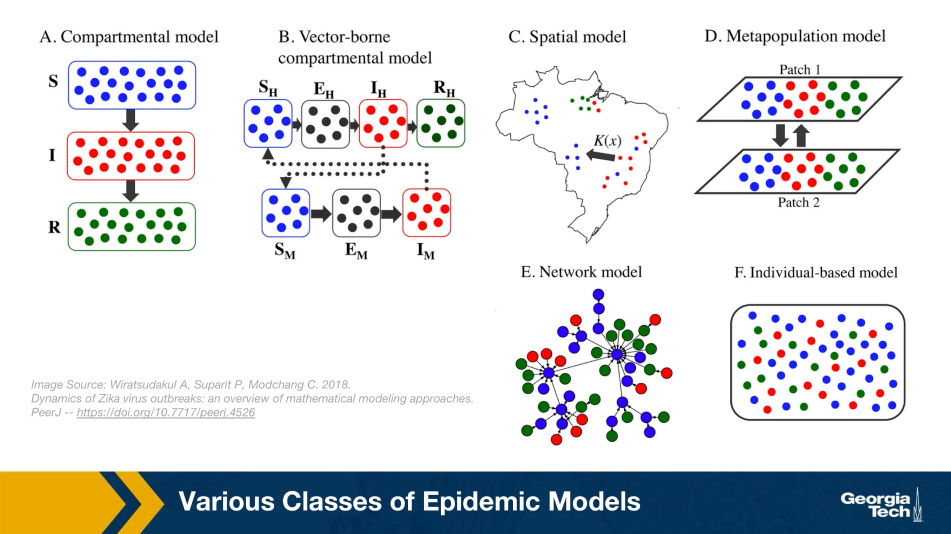
*S: sus, E: exposed, I: infected, R: recovered*

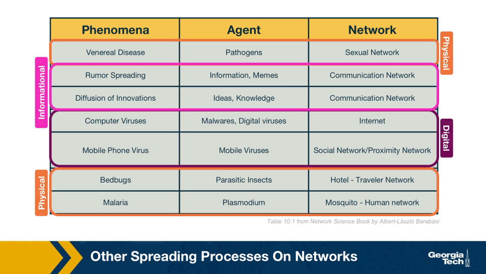

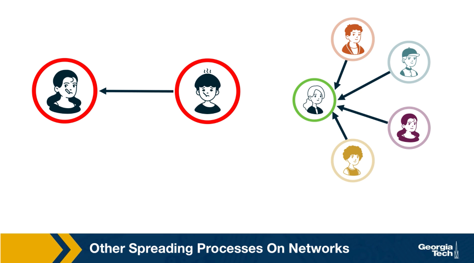
*Differences in spreading process between epidemic (left) and information(right)*

## SI Model

*Figure 10.5 from Network Science by Albert-László Barabási*

Suppose that we have N individuals in the population and, according to the homogeneous mixing assumption, each individual has the same number of contacts k_ (this is shown as <k> in the textbook visualizations). 

In the SI model, there are two compartments: Susceptible (S) and Infected (I) individuals. To become infected, a susceptible individual must come in contact with an infected individual. If someone gets infected, they stay infected.  

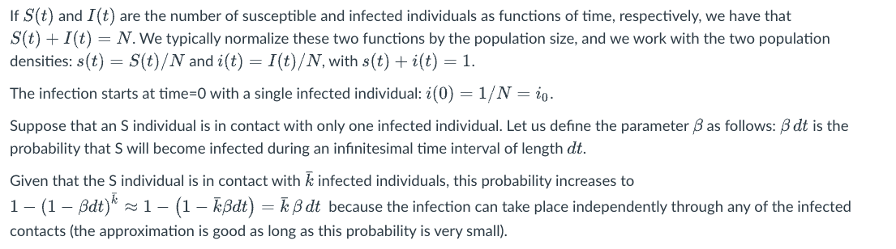
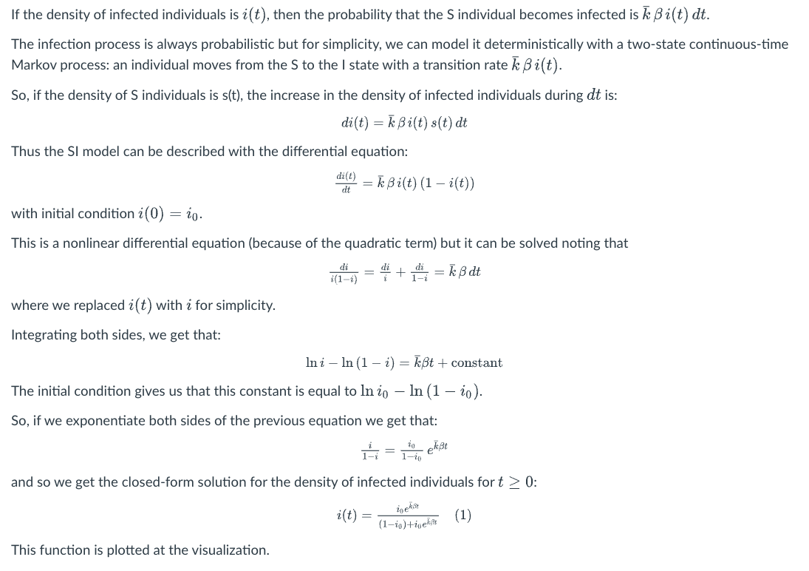
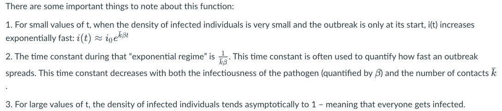

**Food For Thought**
- Perform the last derivation, showing how to get equation (1), in more detail. 

## SIS Model

*Figure 10.5 from Network Science by Albert-László Barabási*

The SI model is unrealistic because it assumes that an infected individual stays infected. In practice, thanks to our immune system, we can recover from most infections after some time period. In the SIS model, we extend the SI model with an additional transition, from the I back to the S state to capture this recovery process. 

The recovery of an infected individual is also a probabilistic process. As we did with the infection process, let us define as μdt the probability that an infected individual recovers during an infinitesimal time period dt. If the density of infected individuals is i(t), then the transition rate from the I state to the S state is μi(t). 

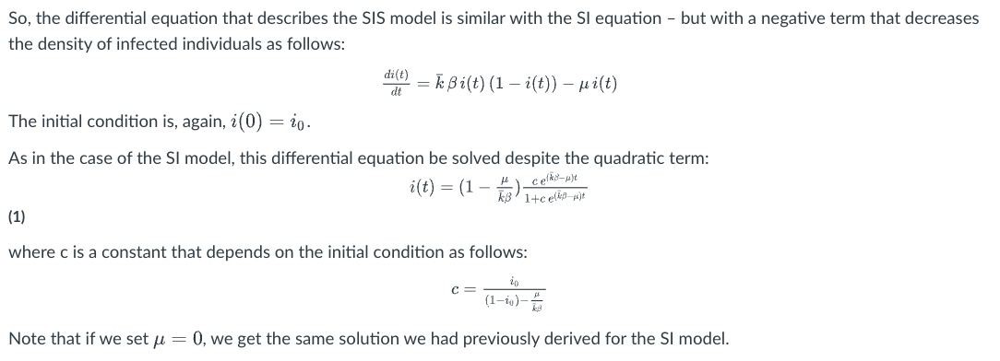

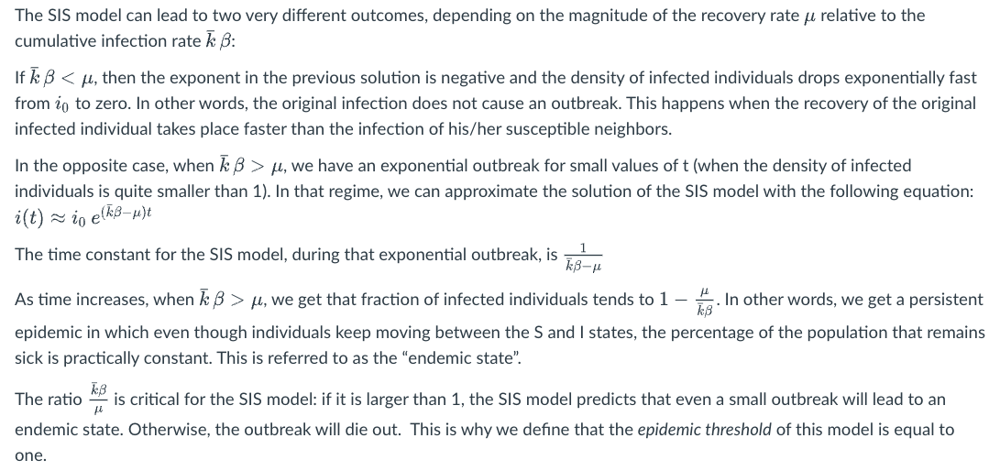

**Food For Thought**
- Derive equation (1) in detail.  

## SIR Model

For some pathogens (e.g., the virus VZV that causes chickenpox), if an individual recovers he/she develops persistent immunity (through the creation of antibodies for that pathogen) and so the individual cannot get infected again.  

For other pathogens, such as HIV, there is no natural recovery and an infected individual may die after some time.  

To model both possibilities, the SIR model extends the SI model with a third state R referred to as “Removed”. The transition from I to R represents that either the infected individual acquired natural immunity or that he/she died. In either case, that individual cannot infect anyone else and cannot get infected again.  

As in the case of the SIS model, we will denote as μ the parameter that describes how fast an infected individual moves out of the infected state (independent of whether this transition represents recovery/immunity or death).  

There are now three population densities, one for each state, and they should always add up to one: s(t) + i(t) + r(t) = 1.

*Figure 10.6 from Network Science by Albert-László Barabási*

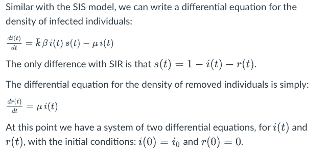

If we solve these equations, the density of S individuals is simply s(t) = 1 - i(t) - r(t).

The previous system of differential equations cannot be solved analytically, however.  Numerically, we get plots such as the visualization (for the case k_ β > μ). In this case, the initial outbreak leads to an epidemic in which all the individuals first move to the infected state (green curve) and then to the removed state (purple line).  

If k_ β < μ, the initial outbreak dies out as in the case of the SIS model, and almost the entire population remains in the S state. 

So the epidemic threshold for the SIR model is also equal to one, as in the case of the SIS model.

## Comparison of SI, SIS, SIR Models Under Homogeneous Mixing

*Figure 10.7 from Network Science by Albert-László Barabási*

This figure summarizes the results for the SI, SIS, and SIR models, under the assumption of homogeneous mixing. 

For the SI model there is no epidemic threshold and we always get an epidemic that infects the entire population.

For the SIS and SIR models we get an epidemic if the ratio (k_\*β) / μ is greater than the epidemic threshold, which is equal to one. In that case, both models predict an initial "exponential regime". The difference between the SIS and SIR models is that the former leads to an endemic state in which a fraction 1 - μ / (k_\*β) of the population remains infected (if the epidemic threshold is exceeded). 

There are more realistic models in the epidemiology literature, with additional compartmental states and parameters. A common such extension is to introduce an **“Exposed”** state E, between the S and I states, which models that individuals that are exposed to a pathogen stay dormant for some time period (until they develop enough viral load) before they become infectious. This leads to the SEIR model.  

Another extension is to consider pathogens in which some infected individuals may acquire natural immunity while others may die. This requires to have two different Removed states, with different transition rates. 

## Number of Partners in Sexual Networks

*Figure 10.13 from Network Science by Albert-László Barabási*

All previous derivations assume that each individual has the same number of contacts . This assumption makes the derivations simpler – but as we will see later in this lesson, it can also be misleading especially when the number of contacts of different individuals varies considerably.  

Let us start with sexually transmitted diseases. The plot at the left shows the distribution of the number of sexual partners, separately for men and women, since sexual initiation in a 1996 survey in Sweden. Note that the plot is in log-log scale. The straight-line decay when the number of partners is larger than 20 suggests that the corresponding distribution follows a power-law. The exponent is about 3 for women and 2.6 for men. Even though most men had less than 10-20 partners, there are also individuals with 100s of partners.  

*Figure 10.14 from Network Science by Albert-László Barabási*

The plot at the right shows is based on a survey of high school students and “romantic relationships”. Note that even though there are 63 couples without any other connections and many other nodes with only 1-2 connections, there are also few nodes with a much higher number of such relationships (up to almost 10).  

Assuming that every individual has the same number of contacts/partners would be very far from the truth at least in these two datasets.  So, clearly, the homogeneous mixing assumption is very unrealistic.

## Number of “Close Proximity” Contacts

*Figure 10.16 from Network Science by Albert-László Barabási*

For airborne pathogens and respiratory diseases such as COVID-19, what matters more is the number of individuals we are in close proximity to. This cannot be measured with surveys but it can be measured with wireless technology such as RFID badges (Radio Frequency Identification) . Various studies have provided volunteers with RFID badges and asked them to wear them throughout the whole day (e.g., on university campuses, dorms, gyms) .

The visualization at the left refers to a network of contacts, mapped using RFID technology, between 232 students and 10 teachers across 10 classes in a school. It is also easy to see that there is a very strong community structure in this network, most likely associated with the different classes the students attend.  

A common conclusion from these studies is that the number of people we come close to varies greatly across individuals. Most of us come physically close to only a small number of specific other people but some individuals interact with hundreds of other people in their daily life. RFID technology can also give us information about the duration of these interactions, which is also a very important factor in the transmission of a pathogen from an infected to a susceptible individual.  

The statistical distribution of these durations is also heavy-tailed, typically following a power-law, meaning that most of our face-to-face interactions are very brief (e.g., saying hi at a corridor) but few interactions last for hours – and typically those are the most dangerous for the transmissions of viruses such as COVID-19, H1N1, influenza, etc.  

## Global Travel Network

Another important factor in the spread of pathogens is the global travel network. Especially with air transportation, in the last few decades, it has become possible for an airborne virus to spread from one point of the planet to all major cities around the world within the first 24 hours.

Imagine, for instance, an infected individual sneezing while waiting at the security control line of a busy airport such as JFK. The passengers around him/her may be traveling to almost every other country on the planet.  

A network that is scale-free with degree exponent γ=1.8
The plot at the right ( Fig.10.15 from Network Science  by Albert-László Barabási) refers to the air transportation network, where the nodes are airports and the links refer to direct flights between airports: the degree distribution of this network is a power-law with an exponent close to 2. Atlanta’s airport is one of the most connected in the world and resides at the tail of this distribution.  

The plot at the right ( Fig.10.15 from Network Science by Albert-László Barabási) refers to the air transportation network, where the nodes are airports and the links refer to direct flights between airports: the degree distribution of this network is a power-law with an exponent close to 2. Atlanta’s airport is one of the most connected in the world and resides at the tail of this distribution.  

## Reproductive Number R0

Epidemiologists often use the **“reproductive number”**, R0, which is the average number of secondary infections that arise from a single infected individual in a susceptible population. 

One way to estimate R0 is to multiply the average number of contacts of an infected individual by the probability that a susceptive individual will become infected by a single infected individual (**“attack rate AR”**). So, the R0 metric does not depend only on the given pathogen – it also depends on the number of contacts each individual has.  

If the number of secondary infections from a single infected individual is R0>1 then an outbreak is likely to become an epidemic, while if R0<1 then an outbreak will not spread beyond a few initially infected individuals.  

In the context of the SIS and SIR models, we can easily show that the reproductive number R0 is equal to the ratio (k_\*β) / μ.  

**The Reproductive Number for Common Infectious Diseases**

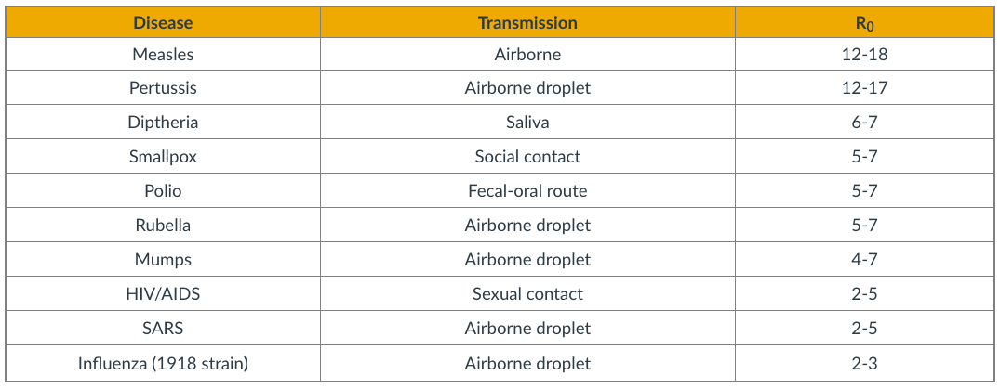

The table shows the estimated reproductive number for some common infectious diseases.  

Note that R0 also depends on the number of contacts -- and so this metric can vary with time because of interventions such as quarantines, social distancing, or safe-sex practices.  The estimates shown in this table should be interpreted as typical values in the absence of such interventions.  

Regarding COVID-19, the debate about its actual R0 is still raging. The first reported result from Wuhan, China was that R0=2.2 – based on direct contact tracing. As of July 2020, there are estimates in the literature that vary from 2.0 to 6.5. 

**Food For Thought**
- Show that in the SIS and SIR models the reproductive number R0 is equal to the ratio (k_\*β) / μ.  

## The Fallacy of The Basic Reproductive Number

*Image Source: [Super-spreaders in infectious diseases](https://www.sciencedirect.com/science/article/pii/S1201971211000245) Richard A.Stein, International Journal of Infectious Diseases, August 2011.*

It is important to realize however that R0 is only an average – it does not capture the heterogeneity in the number of contacts of different individuals (and it also does not capture the heterogeneity in the “attack rate” or “shedding potential” of the pathogen at different individuals). As we know by now, contact networks can be extremely heterogeneous in terms of the degree distribution, and they can be modeled with a power-law distribution of (theoretically) infinite variance. Such networks include hubs – and hubs can act as "superspreaders" during outbreaks. 

SARS (Severe Acute Respiratory Syndrome) was an epidemic back in 2002-3. It infected 8000 people in 23 countries and it caused about 800 deaths. The plot shown here shows how the infections progressed from a single individual (labeled as patient-1) to many others. Such plots result from a process known as “contact tracing” – finding out the chain of successive infections in a population. 

It is important to note the presence of a few hub nodes, referred to as **superspreaders** in the context of epidemics. The superspreaders are labeled with an integer identifier in this plot. The superspreader 130, for example, infected directly dozens of individuals. 

The presence of superspreaders emphasizes the role of degree heterogeneity in network phenomena such as epidemics. If the infection network was more **“Poisson-like”**, it would not have superspreaders and the total number of infected individuals would be considerably smaller. 

**Superspreaders in Various Epidemics**
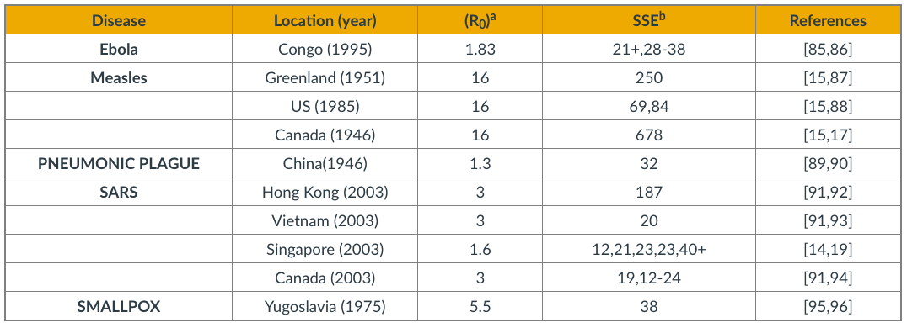
*[Cellular Superspreaders: An Epidemiological Perspective on HIV Infection inside the Body](https://journals.plos.org/plospathogens/article?id=10.1371/journal.ppat.1004092). Kristina Talbert-Slagle et al., 2014*

The table above confirms the previous point about superspreaders for several epidemics.  

The third column shows R0 while the fourth column shows **”Superspreading events”** (SSE). These are events during an outbreak in which a single infected individual causes a large number of direct or indirect infections. For example, in the case of the 2003 SARS epidemic in Hong Kong, even though R0  was only 3, there was an SSE in which an infected individual caused a total of 187 infections (patient-1 in the plot above). 

SSEs have been observed in practically every epidemic – and they have major consequences both in terms of the speed through which an epidemic spreads and in terms of appropriate interventions.  

For example, in the case of respiratory infections (such as COVID-19) **“social distancing”** is an effective intervention only as long as it is adopted widely enough to also include superspreaders. 

## Degree Block Approximation

*Figure 10.9 from Network Science by Albert-László Barabási*

To avoid the homogeneous mixing assumption, one option would be to model explicitly the state (e.g., susceptible, infected, removed) of each node in the network, considering the degree of that node. That would result in a large system of differential equations that would only be solvable numerically.  

Another approach is to group all nodes with a certain degree k together in the same **“block”**. Then, we can ask questions such as: what is the rate at which nodes of degree k move from the S to the I state? In other words, we will not be able to make specific predictions for individual nodes but will be able to characterize the compartmental dynamics of all nodes that have a certain degree. This is referred to as the **“degree block approximation”**. 

This analytical method can be applied to networks with arbitrary degree distribution (including power-law networks). The degrees of neighboring nodes however should be independent. So, even though the degree block approximation is much more general than the homogeneous mixing assumption, it is still not be applicable in networks that have strong assortativity or disassortativity, clustering, or community structure. 

## SIS Model – With An Arbitrary Degree Distribution

Let us go back to the SIS model.

With the degree block approximation, we model the density of susceptible s_k(t) and infected  individuals i_k(t) that have degree k.  

Of course, it is still true that s_k(t) + i_k(t) = 1 because any of these individuals is either in the S or I states.  

We can also write that the density of all infected individuals is: 
i(t) = Sum_k(p_k\*i_k(t))

A susceptible individual of degree k can become infected when he/she is in contact with an infected individual. For nodes of degree k, what is the fraction of their neighbors that are infected however?  Under the homogeneous mixing assumption, this fraction is simply i(t). We now need to derive this fraction more carefully, considering that different nodes have different degrees. 

So, let us define as θ_k(t) as the fraction of infected neighbors of degree k node.  

If we manage to calculate this fraction, we can then write the differential equation for the SIS model under the degree block approximation as: 

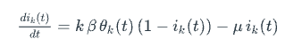

Note that the only real difference with the SIS differential equation under homogeneous mixing is that the term θ_k(t) has replaced the term i(t). The reason is that susceptible individuals of degree k -- their density is (1 - i_k(t)) -- get infected from a fraction  of their θ_k(t) neighbors. 

Now, let us derive θ_k(t).

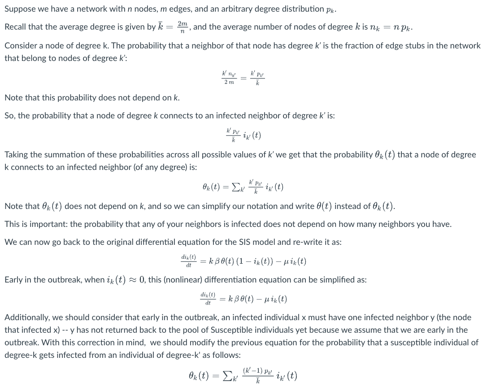
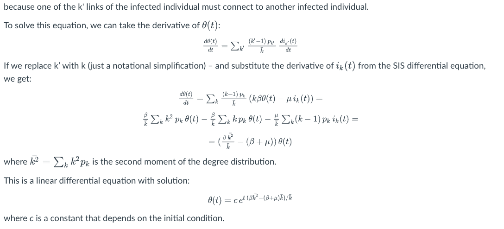

Now that we have solved for θ(t), we could go back and derive the fraction i_k(t) of infected individuals of degree k.  

For our purposes, however, we do not even need to take that extra step. The expression for θ(t) clearly shows that we will have an outbreak if and only if β\*k_^2 - (β + μ)\*k_ > 0, or equivalently, β/(β + μ) > k_/(k_^2).

Contrast this inequality with the corresponding condition under homogeneous mixing, namely: β\*k_ > 0, or equivalently β/μ > 1/k_, 

In other words, when we consider an arbitrary degree distribution, it is not just the average degree that affects the epidemic threshold. The second moment of the degree distribution also matters. And as the second moment increases relative to the first (i.e., the ratio k_ / k_^2 decreases), it is easier to get an epidemic outbreak. 

**Food For Thought**
- Use the derived expression for θ(t) to derive the density i_k(t) of infected individuals of degree k. 

## SIS Model – No Epidemic Threshold For Scale-Free Nets

*Figure 10.11 from Network Science by Albert-László Barabási*

Let us now examine the epidemic threshold for two-degree distributions we have studied considerably in the past. 

1) For random networks with Poisson degree distribution (such as ER networks), the variance is equal to the mean, and so the second moment is: k_^2 = k_\*(1+k_)

So, we have an epidemic if β/(β + μ) > 1/(k_ + 1), which is equivalent to the expression  we derived under homogeneous mixing (β/μ > 1/k_).  

In the visualization, the x-axis parameter λ refers to the ratio β/(β + μ). In the "random network" curve (green), if that ratio is larger than 1/(k_ + 1) an outbreak will lead to an epidemic. The y-axis value shows the steady-state fraction of infected individuals in the endemic state.  

It is important to note that if λ is less than the threshold , then the outbreak will die out and it will not cause an epidemic.  

2) For networks with a power-law degree distribution ("scale-free network" curve shown in purple), and with an exponent γ between 2 and 3, the variance (and the second moment) of the degree diverges to infinity (k_^2 -> infinity).  

This means that the condition for the outbreak of an epidemic becomes: 

λ > k_/(k_^2) -> 0

This is a remarkable result with deep and practical implications. It states that if the contact network has a power-law degree distribution with diverging variance, then **any outbreak will always lead to an epidemic**, independent of how small λ is. Even a very weak pathogen, with a very small λ, will still cause an epidemic.  

The fraction of infected individuals in the endemic state still depends on this ratio – but whether we will get an endemic state or not does **not** depend on λ.  

The reason behind this negative result is the presence of hubs – nodes with a very large degree. Such nodes get infected very early in the outbreak – and then they infect a large number of other susceptible individuals.  

**Food For Thought**
- Suppose that the ratio λ is equal to 1/4. Plot the fraction of infected individuals of k_/k_^2 degree k in the endemic state as the ratio  varies between 0 and 1/4.

## Summary of SI, SIS, SIR Models with Arbitrary Degree Distribution 

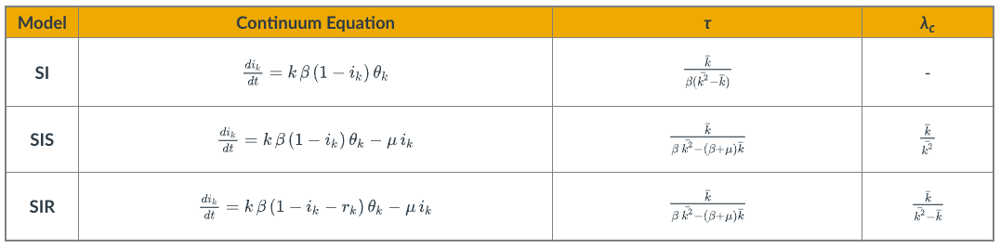

Even though we showed the derivations for the density function θ(t) only for the SIS model, it is simple to write down the corresponding equations for the SI and SIR models.  

The table summarizes the differential equation and key results for each of the three models.  

The parameter τ is the characteristic timescale.

The SI model always leads to an epidemic. For the two other models, however, the epidemic threshold depends on the ratio of the first two moments of the degree distribution. λ_c is the minimum value of λ for the emergence of an endemic state (only for SIS and SIR).  

We suggest that you contrast these results with the corresponding formulas for the case of homogenous mixing.  

**Food For Thought**
- Repeat the derivations we performed in this lesson for the SIS model in the case of the SI and SIR models. 

## Computational Modeling of Epidemics

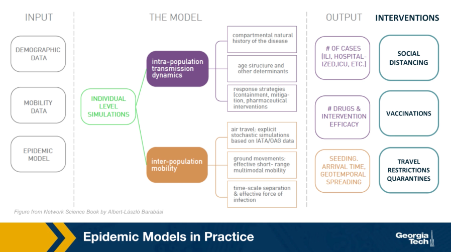

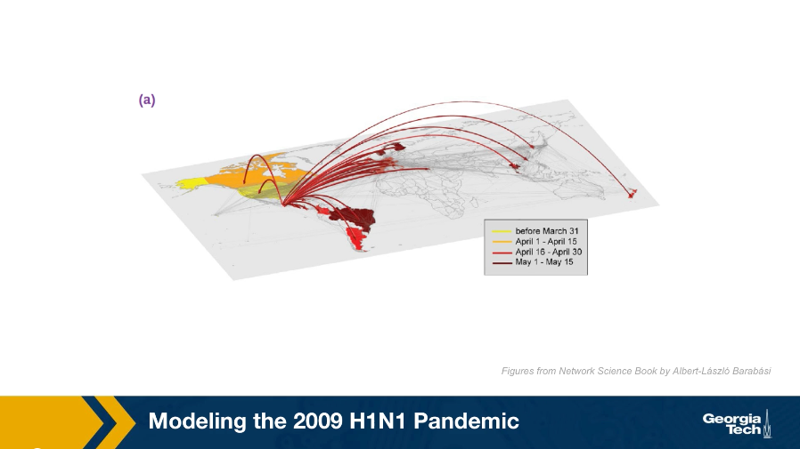

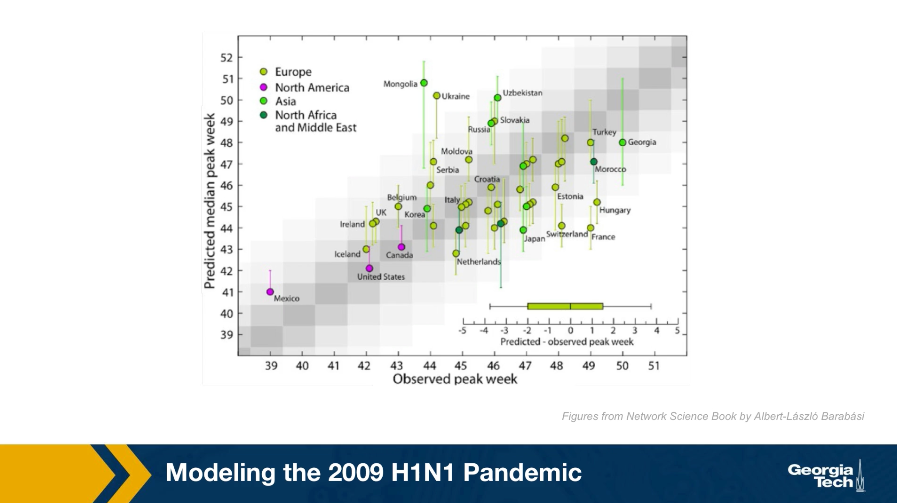

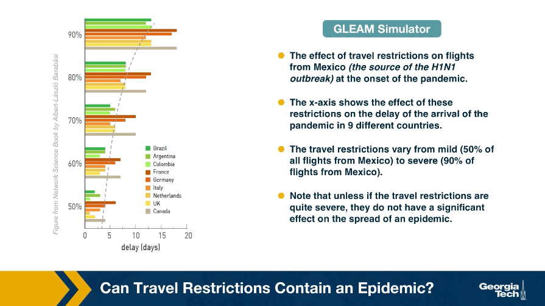

## Effective Distance

Can we use geographical distance to predict the time that an epidemic will arrive at a state or country?  

Again, we can use epidemic models such as GLEAM to answer such questions.  

*Figure 10.32 from Network Science by Albert-László Barabási*

The plot at the left shows the geographic distance between Mexico and many other countries at the x-axis, while the y-axis shows the time that the H1N1 pandemic arrived in that country (defined as the number of days between the first confirmed case in that country and the beginning of the outbreak on March 17, 2009). 

Clearly there is not any strong correlation between the two quantities.  

Let us now define a different kind of distance, based on mobility data rather than geography: 

Suppose that we have data from airlines, trains, busses, trucks, etc, showing how many travelers go from city i to city j.  

The fraction of travelers that leave city i and arrive at city j is denoted by p_i,j. 

The effective distance between the two cities is then calculated as d_i,j = 1 - ln(p_i,j).  

The plot at the right replaces geographic distance with **“effective distance”**, and it shows that that the arrival day of this pandemic from Mexico was actually quite predictable based on strictly mobility data.  

## Lesson Summary

This lesson introduced you to several important points about epidemics on networks: 

1. Compartmental epidemic models such as SIS and SIR under the homogeneous mixing assumption 
2. The basic reproductive number and how it can be misleading in the presence of super-spreaders 
3. Epidemic threshold 
4. Real-world contact networks do not follow the homogeneous mixing assumption 
5. How the spread of an epidemic depends on the second moment of the degree distribution 
6. Power-law networks with diverging degree variance do not have an epidemic threshold 
7. Computational modeling of epidemics 

We will continue our study of spreading processes on networks in the next Lesson, considering some more advanced topics about epidemics as well as the spread of other entities on networks such as information and memes.  

