# Module 4 Lesson 10 - Social Influence and Other Network Contagion Phenomena

## Learning Objectives
Students will be able to:

- Explain and analyze common models of influence on social networks 
- Select optimal “seed nodes” for maximum influence 
- Measure cascade phenomena on networks experimentally
- Apply contagion modeling in practice, through case studies  

## Required and Recommended Reading

**Required Reading**

- Chapter 19 -  D. Easley and J. Kleinberg, [Networks, Crowds and Markets](https://www.cs.cornell.edu/home/kleinber/networks-book/networks-book-ch19.pdf), Cambridge Univ Press, 2010.

**Recommended Reading**
- [“The role of social networks in information diffusion”](https://dl.acm.org/doi/abs/10.1145/2187836.2187907). by E.Bakhsy et al. WWW conference, 2012.
- [“Everyone's an influencer: quantifying influence on Twitter”](https://dl.acm.org/doi/abs/10.1145/1935826.1935845). by E.Bakshy et al. WSDM conference, 2011.
- ["Maximizing the spread of influence through a social network"](https://dl.acm.org/doi/abs/10.1145/956750.956769). by D.Kempe et al. ACM SIGKDD, 2003.
- [“A simple rule for the evolution of cooperation on graphs and social networks”](https://www.nature.com/articles/nature04605). by H. Ohtsuki et al, Nature, 2006. 
- ["Multisensory integration in the mouse cortical connectome using a network diffusion model"](https://direct.mit.edu/netn/article/4/4/1030/95854/Multisensory-integration-in-the-mouse-cortical). by K.Shadi et al., Network Neuroscience, 2020.

## Not Just Viruses Spread On Networks

**“Word of mouth”** is a powerful influence mechanism and it affects every aspect of our lives. 

Think about behavior adoption: Do you like to exercise, eat healthy, party, smoke marijuana? It has been shown again and again that whether someone will adopt such behaviors or not mostly depends on his/her social network. And interestingly, it is not just strong contacts (such as family and close friends) that influence people. Our entire social network, including the crowd of acquaintances and indirect contacts that surround us, also have a strong effect on behavior adoption. 

A great reference that summarizes many years of sociology research in this area is the book“Connected” by Christakis and Fowler. 

Similar influence mechanisms are seen in other aspects of life. For example, in terms of technology adoption, will you buy an iPhone or an Android device? Think about your 10 closest people and ask: what phone do they own? You guessed right – your consumer and technology adoption choices are highly influenced by your social network. 

Or, in the case of opinion formation: are you a Democrat or a Republican? What do you think about climate change? Abortion? Again, please think about your 10 closest people and ask the same question. Even though we like to think that we are the absolute owners of our opinions, the reality is that we would probably have very different opinions if we lived in a different social environment.

For centuries, the word-of-mouth mechanism required physical interaction between people. In the last few years, however, online social media such as Facebook, Twitter, or TikTok have provided us with the platform to influence not only the small number of people in our physical proximity – but potentially millions of people around the world. 

YouTube or Twitter “influencers” today have tens of millions of followers – and it is often the case that their videos or tweets are being liked, commented on, or forwarded by millions of other people. Never before in the history of humankind, we found ourselves in the middle of so many sources of information (or misinformation), and never before every single one of us has at least the potential to influence pretty much any other person on the planet.

## Diffusion, Cascades and Adoption Models

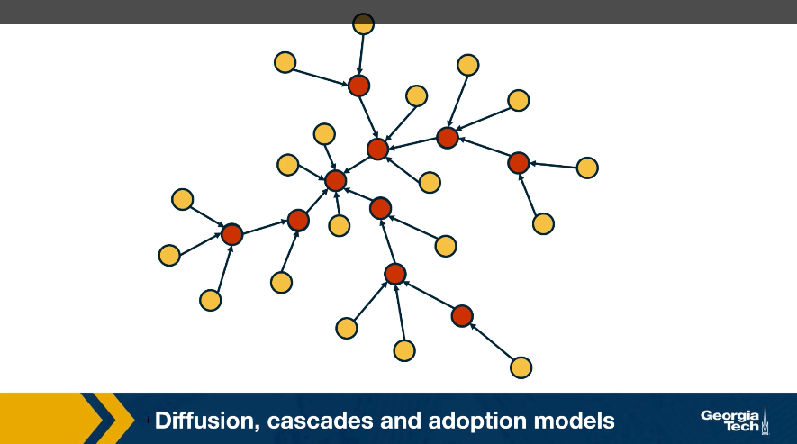
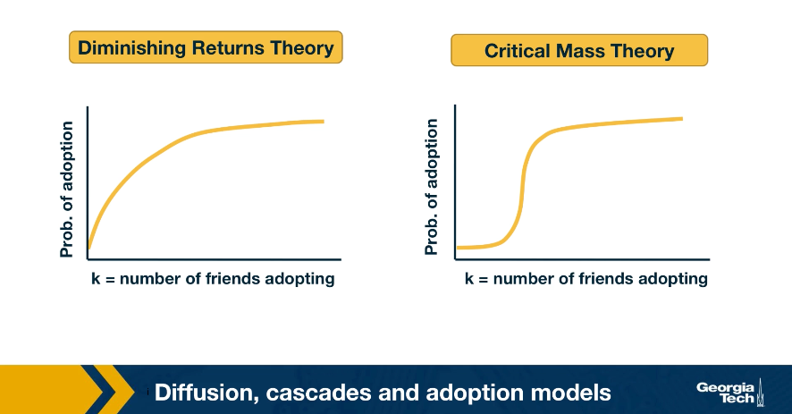

## Some Empirical Findings About Cascades

*Image Source: [“The role of social networks in information diffusion”](https://dl.acm.org/doi/pdf/10.1145/2187836.2187907).by Bakhsy et al*

Image Source: “The role of social networks in information diffusion” Links to an external site.by Bakhsy et al

We summarize here some general findings that have been observed repeatedly in the last few years in the context of different social networks and experiments of social influence 

The first such finding is that the probability of adoption seems to follow, at least in most cases, the diminishing returns model.

For instance, we include here a result from a large-scale (253 million Facebook users) randomized study by Eytan Bakhshy and his collaborators. The main question was whether a user will share a Web link with his/her Facebook friends, depending on whether some of his/her friends also shared that link. The study also examined how this **“probability of link sharing”** depends on whether users were exposed to their friends’ link-sharing behavior (**“feed”**) versus those that were not exposed to such information (**“no feed”**).

Note that in both cases the probability of adoption increases in a concave manner, providing support to the diminishing returns model.

The authors also showed that those who are exposed to their friends’ link-sharing behavior are significantly more likely to spread information and do so sooner than those who are not exposed.

The study also examined the relative role of strong and weak ties in information propagation. Although stronger ties are individually more influential, it is the more abundant weak ties that are responsible for the propagation of novel information.

*Image Source: [“Everyone's an influencer: quantifying influence on Twitter”](https://dl.acm.org/doi/pdf/10.1145/1935826.1935845). by E.Bakshy et al.*

Another empirical finding that has been repeatedly shown by many studies of online social networks relates to the size and depth of cascades.

For instance, an observational study of Twitter data analyzed 74 million tweet cascades that mention a URL. The tweets originated from 1.6 million **“seed”** users during a two-month period in 2009.

A first major observation is that the vast majority  (90%) of tweets do NOT trigger a network cascade. They stop at  the source. An additional 9% propagate only to one other user.

However, even though very few tweets trigger a significant network cascade, it is interesting that there are also tweets that cause major cascades, with a size that exceeds 1000 users and a depth of 8 or higher.

The distribution at the left shows that the cascade size follows a power-law distribution -- note that both axes are logarithmic and the function decreases almost linearly.

The distribution at the right shows that the cascade depth follows an exponential decrease --  note that the x-axis is linear while the y-axis is logarithmic and the decrease is almost linear.

These findings are not applicable only to Twitter cascades – similar results have been shown for most other diffusion phenomena in both offline and online social networks.

**Food For Thought**
- Read the original paper mentioned in this page to see how the authors quantified the effect of strong versus weak ties.
- The literature includes many more similar empirical results about the distribution of cascade size or cascade depth. Review the literature to find at least one more such reference. 

## Linear Threshold Model

Let us now see how we can model influence and social contagion with network models. 

Consider a weighted (and potentially directed) network. The weight of the edge w_u,v represents the strength of the relationship between nodes u and v. If the two nodes are not connected, we set w_u,v = 0.

The state of a node v can be either **"inactive”** (s_v = 0) or **“active”** (s_v = 1).

In the context of social influence, for example, an inactive node may not be exposed to a certain behavior (e.g., smoking) or it may be that it has been exposed but it has not adopted that behavior.

Initially, the only active nodes are the sources of the cascade.

Each node v has a threshold θ_v. The Linear Threshold model assumes that a node v becomes active if the cumulative input from active neighbors of v is **greater** than the threshold θ_v:

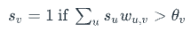

**Note that nodes can only switch from inactive to active once.** 

The Linear Threshold model is appropriate in diffusion phenomena when the **”critical mass”**theory of social influence applies.

An important question is: if we only activate a certain node v_0, which are the nodes that will eventually become active? These nodes define the “activation cascade” of v_0. Note that this cascade may cover the whole network, may include only v_0, or it may be somewhere in between. Of course, the cascade of v_0 includes nodes that are reachable from v_0.

A common simplification of the linear threshold is the **homogeneous case** in which all nodes have the same threshold θ. In the visualization, the threshold is set to θ = 1 for all nodes. Note that the nodes x and z will not be part of the cascade.

There are also variations of the model in which two behaviors A and B are spreading at the same time, meaning that the state of a node can take three different values (inactive, A and B). In that case, the state of a node can switch between states A and B over time.

Another common variation is the **“Asynchronous Linear Threshold”** model. In that case, each edge has a certain delay. This means that different nodes can become active at different times.

The edge delays can affect the temporal order in which nodes join the activation cascade – but they cannot change the size of the cascade. We will review an application of this model on brain networks at the end of this lesson.

Note: Depending on the literature, the activation threshold model can be greater than or greater than or equal to - this can vary.

**Food For Thought**
- Explain why the size of the cascade does not depend on edge delays.

## Independent Contagion Model

In some cases the activation of a node v can be triggered by a single active neighbor of v, independent of the state of other neighbors of v. The Independent Contagion model is more appropriate in such problems.

Again, the state of each node can be inactive or active. If there is an edge from u to v, then the weight w_u,v of the edge in this model represents the probability that node u activates node v when the former becomes active.

Note that node u has a single chance to activate node v. Nodes stay in the active state after they have been activated.

An important difference with the Linear Threshold model is that the Independent Contagion model is probabilistic, and so the activation cascade of a seed node v has to be described statistically.

**Food For Thought**
- Explain why the Independent Contagion model is consistent with the Diminishing Returns theory of social influence. 

## Deffuant Model For Opinion or Consensus Formation

In some cases, it is a gross oversimplification to represent the state of each node as a binary variable (active vs inactive).

Instead, we need a scalar to represent the state of each node.

For example, our opinion about the risk of a potential COVID-19 infection may vary anywhere between the two extremes “I am extremely worried” to “I do not care at all”.

Typically, our opinion about such matters depends on the opinion of our social contacts.

The Deffuant model of opinion (or consensus) formation assumes that the state of a node v at time t is a scalar s_v(t) that falls between 0 and 1.

A key parameter of the model is the **“tolerance threshold”** δ:

If the state of two connected nodes, say u and v, is greater than the threshold δ: |s_v(t) - s_u(t)| >= δ, the two neighbors “disagree” so strongly that they do not influence each other, and their state remains as is.

Otherwise, if |s_v(t) - s_u(t)| < δ,  then they influence each other, changing their state at the next time instant as follows:

s_v(t+1) = s_v(t) + μ[s_u(t) - s_v(t)]

and

s_u(t+1) = s_u(t) - μ[s_u(t) - s_v(t)]

where μ is the "convergence" parameter of the model.

If μ = 1/2, then the state of the two nodes will become identical at time t+1. Typically μ is set to a value between 0 and ½ to capture that the two neighbors may not reach complete agreement.

The model proceeds iteratively, by selecting a randomly chosen pair of neighbors in each iteration. If the network is weighted then the order at which pairs of nodes interact may depend on the weight of the corresponding edge.

Note that whether two neighbors influence each other or not may change over time.

For example, consider the network shown in the visualization (μ=1/2, δ=0.45). Suppose that we select pairs of neighboring nodes in the following order:

1. x and z: their opinion converges to s_x = s_z = 0.15
2. u and v: their opinion converges to s_u = s_v = 0.6
3. u and z: their opinion does not change
4. v and y: their opinion converges to s_v = s_y = 0.6

At that point, the opinion of every node has converged to a final value because any pair of adjacent nodes either have the same opinion, or their opinion differs by more than the threshold δ.

**Food For Thought**
- The Deffuant model can result in interesting dynamics. Suppose that we have a social network in which almost all individuals are moderates (say their initial opinion is close to 0.5). There are also few extremist nodes though, some of them with an opinion that is close to 0 and others with an opinion that is close to 1.
- Can you construct a scenario in which the entire network will become polarized, with every node being very close to one extreme or the other? What kind of initialization and network topology would make such an outcome more likely?

## Game Theoretic Diffusion Models

In some cases, the behavior of nodes in a social network can be captured more realistically with game-theoretic models: each node is a player that chooses rationally between a set of strategies. Crucially, the **“payoff”** of each strategy for player v also depends on the strategies chosen by the neighbors of v.

Let us illustrate this class of models with a simple coordination game. Each player can choose to either **“Cooperate”** (work with others) or **“Defect”** (act selfishly).

Cooperating with a neighboring player comes at a cost c (independent of the strategy of that neighbor). If two players cooperate, they both get a benefit b from their connection.

Of course, it only makes sense to cooperate if b > c.

The problem however is that some players may choose to Defect. In that case, they get the benefit b from every Cooperator they interact with – and they do not pay any cost. Think of the "friend" that will borrow things from you but he/she would never lend you anything. 

The payoff matrix of this game for Player-1 is shown at the visualization.

Each player interacts only with its neighbors. Further, when a player chooses a strategy (say to be a Cooperator), that strategy applies to all bilateral interactions with its neighbors.

So, if a player v has k connections, and m of those neighbors are Cooperators, then if v chooses to be a Cooperator its payoff will be bm - ck. It obtains a benefit b from each neighbor, but pays an additional penalty c for every connection.

If it chooses to be a Defector, its payoff will just be bm.

If a node is surrounded by Cooperators, then it would benefit in the short-term by becoming a Defector. But its neighbors would also decide to do the same, and they would all become Defectors.

So eventually, the payoff of all players will be lower than if they had all remained Cooperators.

This illustrates how selfish behavior may quickly spread on a network, even if it is harmful to everyone in the long term.

**Food For Thought**
- The model we described here is very simple and it predicts that even a single Defector is sufficient to turn the whole network into Defectors.
- More sophisticated models, based on evolutionary game theory, predict that under certain conditions that depend on the network topology, the strategy of Cooperation will persist even in the presence of some Defectors.
- We recommend you read the paper: [“Links to an external site.A simple rule for the evolution of cooperation on graphs and social networks”](https://www.nature.com/articles/nature04605). by H. Ohtsuki et al, Nature, 2006. 

## Seeding for Maximum Network Cascade

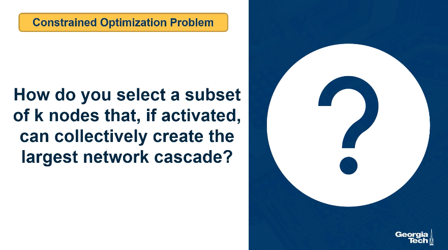

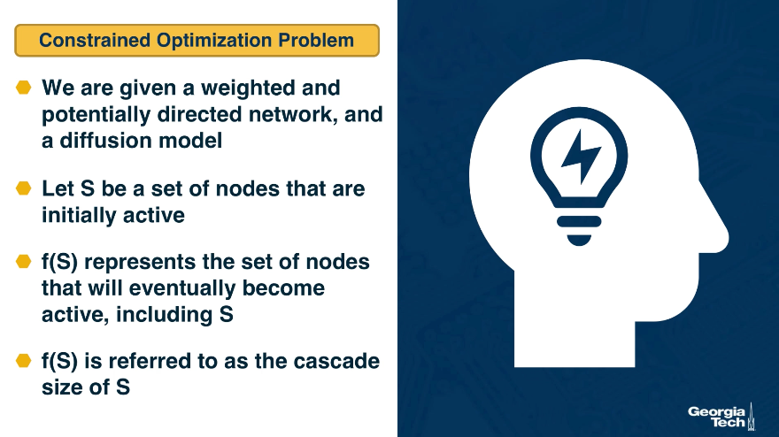
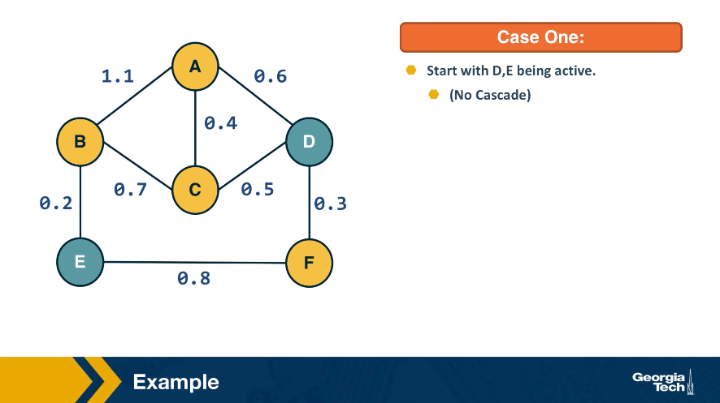
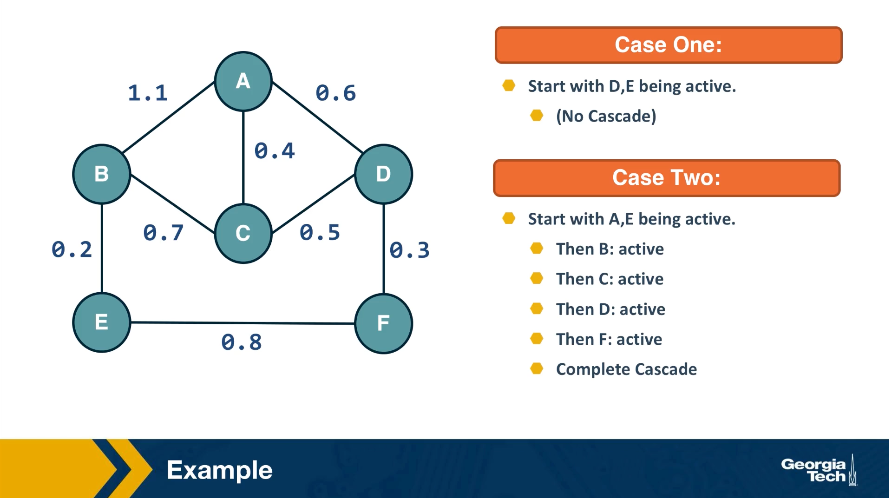

## Submodularity of Objective Function

The function we try to maximize, f(S), is nonlinear and it obviously depends on the topology of the network as well as on the specific diffusion model.

As we will see at the next page, however, the function f(S) has an interesting property referred to as **“submodularity”**.

In this page, we first define submodularity – and then state an important result on how to optimize such functions.

Suppose that a function f(X) maps a finite subset X of elements from a ground set U to non-negative real numbers.

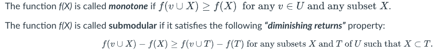

In other words, the marginal gain from adding an element v to a set X is at least as high as the marginal gain from adding the same element to a superset T of X.

Dr. Nemhauser (a professor at Georgia Tech) and his colleagues proved the following facts about monotone and submodular functions:

- The bad news: optimizing such functions, subject to the constraint that X includes k elements, is an NP-Hard problem, and so it cannot be solved efficiently by any algorithm (unless if P=NP).
- The good news: Consider an iterative greedy heuristic that adds one element in X in each iteration, selecting the element that gives the maximum increase in f(X). This simple algorithm has an approximation ratio (1 - 1/e). This means that the greedy solution cannot be worse than about 63% of the optimum value of f(X).

The previous result is very important in practice because it means that, even though the greedy algorithm is suboptimal, we have a reasonable bound on its distance from the optimal solution.

**Food For Thought**
- Prove that a non-negative linear combination of a set of submodular functions is also a submodular function.

## Monotone and Submodular Function

Now that we know how to optimize, at least approximately, monotone and submodular functions, we can go back to the problem of maximizing network diffusion. Suppose that S is one or more initially active nodes, and g(S) is the resulting cascade of active nodes.  Is the cascade function g(S) monotone and submodular?

The fact that the cascade size is monotone is obvious: if we increase the number of initially active nodes, we cannot decrease the size of the cascade.

It is also possible to show that the cascade size is a submodular function, for both the Linear Threshold and the Independent Cascade model. Let us focus on the latter here.

With the Independent Cascade model, we can first randomly choose for every edge of the network whether it is **“live”** or **”blocked”**, based on its activation probability.

The set of live edges for such a specific random assignment can then be used to determine the set of active nodes at the end of the cascade.

**The important point is that a node w will be part of the cascade if and only if there is a path of live edges from the initially active node(s) to w.**

To prove the submodularity of the cascade size, we need to show that the number of NEW nodes that become active after we add a **node v** in the set of active nodes is larger for S than for its superset T. 

Please refer to the above diagram. S is a subset of T, and g(S) and g(T) are the corresponding sets of active nodes.

There are two cases:

- The new nodes that become active after the activation of v are neither in g(S) nor in g(T).
- The new active nodes are in g(T) but not in g(S). 
Note that it cannot be that the new active nodes are in g(S) but not in g(T).

So, more nodes are activated when v is added to S compared to when v is added to T.

The previous argument holds for the random assignment of live edges we started from. To show that the **expected value of the cascade size** is also submodular, we need to use the fact that: if a set of functions f1, f2, f3 ... are submodular, then any non-negative linear combination of those functions is also submodular (non-negative because the scaling coefficients are probabilities). Recall that this was the "food-for-thought" question at the previous page. 

## Cascades in Networks with Communities

*Image source: Textbook [“Networks, Crowds and Markets”](https://www.cs.cornell.edu/home/kleinber/networks-book/networks-book-ch19.pdf). book, by Easley and Kleinberg, Chapter 19*

We have already established in earlier lessons that most real-world networks have clusters of strongly connected nodes that we refer to as communities.

How do such communities affect the extent of diffusion processes, such as those discussed earlier in this lesson?

Is it that the community structure facilitates or inhibits the diffusion of information on networks?

To make this analysis more concrete, let us start with a quantitative definition of a network community structure:

We say that a set of nodes C forms a cluster (or community) of density p if **every node in that set has at least a fraction p of its neighbors in the set C**.

The visualization shows three such clusters of nodes, each of them containing four nodes, with density p=2/3.

## Cascades in Networks with Communities-2

*Image source: Textbook [“Networks, Crowds and Markets”](https://www.cs.cornell.edu/home/kleinber/networks-book/networks-book-ch19.pdf). book, by Easley and Kleinberg, Chapter 19*

Suppose that we model the diffusion process with the Linear Threshold Model. To keep things simpler, let us consider the homogeneous version of this model in which all edge weights are the same.

If the threshold is θ then a node becomes active if and only if at least a fraction θ of its neighbors are active.

The visualization shows an example in which the cascade starts from two nodes (nodes 7 and 8). If the threshold θ is larger than 2/3, the cascade will not expand beyond those initial nodes.

If θ = 2/5, then the cascade in this example will expand to the seven nodes that are highlighted within 3 steps. In the first step, nodes 5 and 10 will become active. In the second step, nodes 4 and 9 will become active. And in the third step, node 6 will become active. The cascade will stop at that point.

Note that these 7 highlighted nodes form a cluster of density p=2/3.

Is there a relation between the density of the cluster p, and the maximum value of the activation threshold θ that is required for the establishment of a complete cascade in the network?

This is the main result we will establish on the next page.

## How do Dense Clusters Affect Cascades?

*Image source: Textbook [“Networks, Crowds and Markets”](https://www.cs.cornell.edu/home/kleinber/networks-book/networks-book-ch19.pdf). book, by Easley and Kleinberg, Chapter 19*

We will first prove the following result:

Suppose that we model the diffusion process using the Linear Threshold Model with threshold value θ.

If the set of initially active nodes is A, then the cascade will NOT cover the whole network if the network includes a cluster of initially inactive nodes with density greater than 1 - θ.

**Proof:** We will prove this by contradiction - we start with an assumption, then following a series of steps which leads to a result that cannot be true. Consider such a cluster of initially inactive nodes with density greater than 1 - θ. Assume the opposite of what we want to prove, i.e., that one or more nodes in this cluster eventually become active. Let v be the **first** such node in the cluster. 

At the time v became active, its only active neighbors could be outside the cluster. But since the cluster has density greater than 1 - θ, at least a fraction 1 - θ of v's neighbors are in the cluster. So, less than a fraction θ of v's neighbors are outside the cluster. Even if all of those neighbors were active, that would not be enough to activate v. This leads to a contradiction, and so it cannot be that the cluster eventually includes an active node.

Moreover, we can show the following related result:

If a network cascade that starts from a set of initial nodes A does not cover the whole network, then the network must include a cluster of density greater than 1 - θ.

**Food For Thought**

- Prove the last result stated above. The visualization at the right will help you to think about the proof.

## Network Diffusion in the Brain

Reference: ["Multisensory integration in the mouse cortical connectome using a network diffusion model"](https://www.mitpressjournals.org/doi/abs/10.1162/netn_a_00164?mobileUi=0) by K.Shadi et al., Network Neuroscience, 2020.

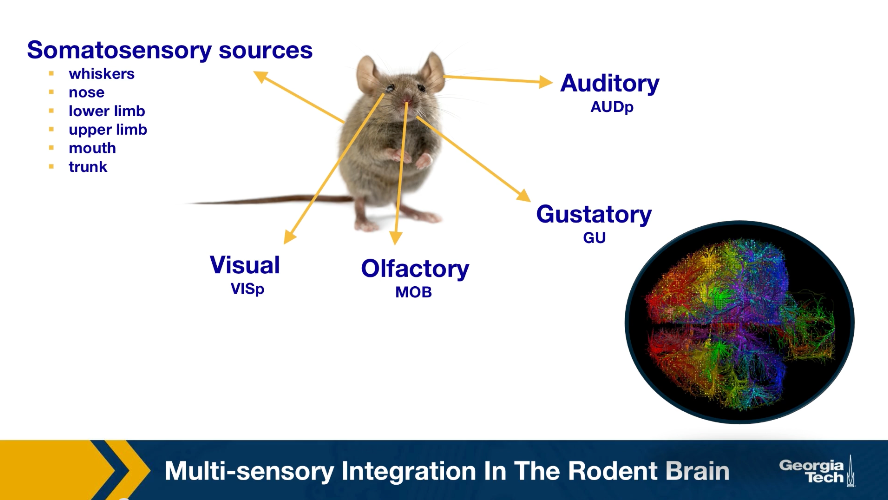

## Asynchronous Linear Threshold (ALT) Model

The unweighted Linear Threshold model assumes that a **"node"** (brain region in this case) becomes active when more than a fraction of the neighboring nodes it receives incoming connections from being active.

Here, we use a variation of this model with a) weighted connections, where the weights are based on the connection density of the projections, and b) connection delays, where the delays are based on the physical distance between connected brain regions.

The state of a node-i is initially s_i(t) = 0.  It becomes equal to 1 when:

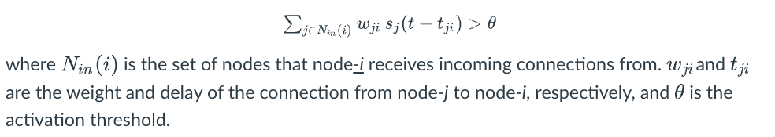

The ALT model is simple yet it incorporates information about distances between brain regions (to model connection delays) and uses local information (a thresholding nonlinearity) to potentially gate the flow of information.

The previous visualization  shows a toy example with five nodes. The source of the cascade is node n1. Each edge shows two numbers, the first is its delay, and the second is its weight. The activation threshold is set to θ = 1. The cascade takes 7-time units to propagate throughout the whole network.

The visualization at the left shows the DAG that represents the activation cascade. For example, the activation of node n3 takes place only after nodes n1, n2 and n4 become active.

## Experimental Validation of ALT Model

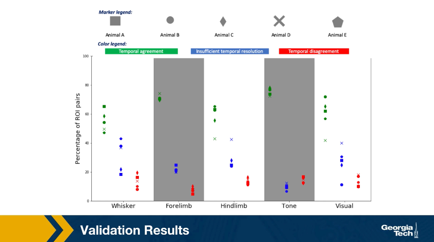

## Lesson Summary

This lesson focused on information diffusion processes on networks.

- We started with some common empirical findings about the size and depth of the cascades that these diffusion processes create .

- Then, we reviewed some common mathematical models, such as the Independent Cascade model, that are often used to study such network diffusion processes.

- Then, we examined an important optimization problem in the context of network diffusion: if we can start a cascade from say k nodes, which nodes should we select to maximize the size of the cascade?

- We also considered the effect of community structure on the extent of the diffusion process on a network.

- Finally, we presented a case study of a network diffusion process on brain networks, in the context of multi-sensory integration.

