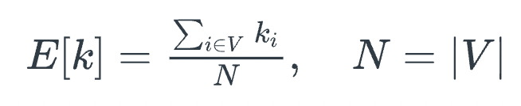
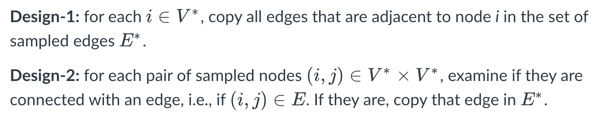
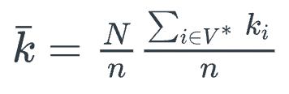
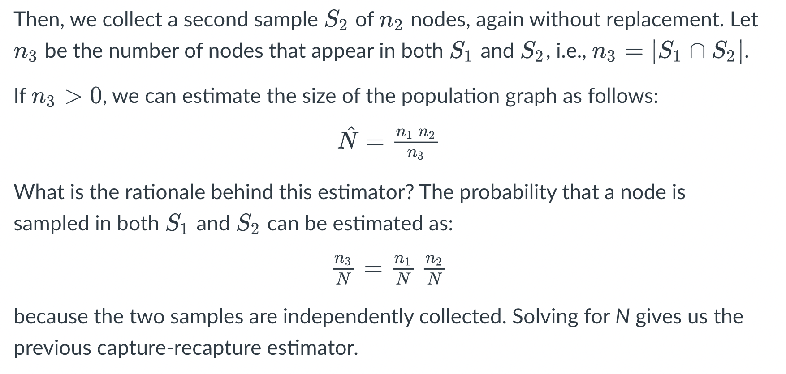
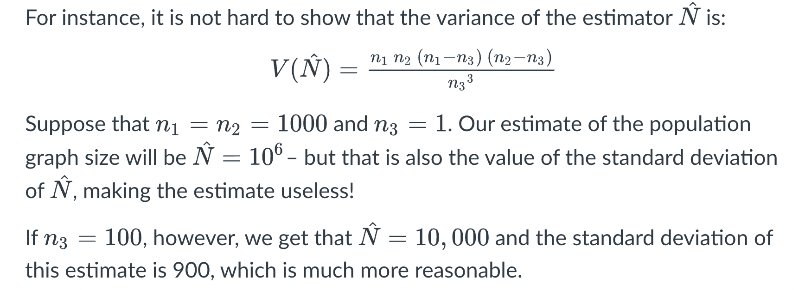

# Module 5 Lesson 13 - Introduction to Network Sampling

## Learning Objectives
Students will:

- Understand some major questions and methods in "network inference"
- Learn key network sampling strategies
- Review link prediction statistical methods
- Infer association networks based on correlation metrics
- Understand the principles of network tomography through theory and case studies
 

## Required and Recommended Reading
**Required Reading**
- [Sampling and estimation in network graphs](https://link.springer.com/chapter/10.1007/978-0-387-88146-1_5), by Eric D.Kolaczyk, 2009
- [Network inference with confidence from multivariate time series](https://journals.aps.org/pre/abstract/10.1103/PhysRevE.79.061916), by Mark Kramer et al, 2009
- [Network topology inference](https://link.springer.com/chapter/10.1007/978-0-387-88146-1_7), by Eric D.Kolaczyk, 2009

**Recommended Reading**
- [What is the real size of a sampled network? The case of the Internet](https://journals.aps.org/pre/abstract/10.1103/PhysRevE.75.056111) by Fabian Viger et al., 2007

## Introduction to Network Sampling
It is often the case that we do not know the complete network. Instead, we only have sampled network data, and we need to rely on that sample to infer properties of the entire network. The area of statistical sampling theory provides some general approaches and results that are useful in this goal.

Let us denote the complete network as G = (V,E) – we will be referring to it as the **population graph**.

Additionally, we have a **sampled graph** G* = (V*,E*), which consists of a subset of nodes V* and edges E* from the population graph.

To illustrate the challenges involved in network sampling, consider the following problem.

Suppose we want to estimate  the average degree of the population graph, defined as

where k_i is the degree of node-i and N is the number of nodes in the population graph.

The obvious approach is to estimate this with the average degree of the sampled graph G* as follows:

where n is the size of the sample.

Now, consider two different network sampling strategies, or “designs”. In both of them we start with a random sample V* of n nodes:

Note that Design-1 requires that we know all neighbors of each sampled node, even if those neighbors are not sampled – while Design-2 only observes the adjacencies between sampled nodes. In practice, this means that Design-2 would be simpler or less costly to conduct. Imagine, for example, that we construct a social network based on who is calling whom. Design-1 would require that we know all phone calls of the sampled individuals. Design-2 would require that we only know whether two sampled individuals have called each other.

Which of the two Designs will result in a better estimate of E[k] in your opinion? Please think about this for a minute before you look at the answer below.

If you answered Design-1, you are right. With Design-2, we underestimate the degree of each node by a factor of roughly n/N because, on the average, we only “see” that fraction of nodes of the population graph.

That does not mean however that Design-2 is useless. As we will see later in this Lesson, we could use Design-2 and get a reasonable estimate of the average degree as long as we add an appropriate “correction factor”. For example, we could get a better estimate with Design-2 if we use the following correction:

This can be a useful approach if Design-2 is simpler or cheaper to apply than Design-1.

Here is another example of how statistical sampling theory can be useful: imagine that you want to estimate the number N of nodes in the population network G. For practical reasons however, it is impossible to identify every single node in G -- you can only collect samples of nodes. How would you estimate N? Please think about this for a minute before you read the following.

Image source: http://www.old-ib.bioninja.com.au/options/option-g-ecology-and-conser/g5-population-ecology.html

We could use a statistical technique called **capture-recapture estimation**. The simplest version is that we first select a random sample S_1 of n_1 nodes, without replacement. The important point is that we somehow “mark” these nodes. For instance, if they have a unique identifier, we record that identifier.

In sampling theory, two important questions are:

- a) Is the estimator unbiased, meaning that its expected value is equal to the population-level metric we try to estimate. In the previous example, is it that E[^N] = N, across all possible independent samples S_1 and S_2?
- b) What is the variance of the estimator? Estimators with large variance are less valuable in practice.

**Food For Thought**
For the previous estimator ^N, show that if n_1 and n_2 are fixed, the variable n_3 follows the hypergeometric distribution. Use this result to derive the previous expression for the variance of ^N.

